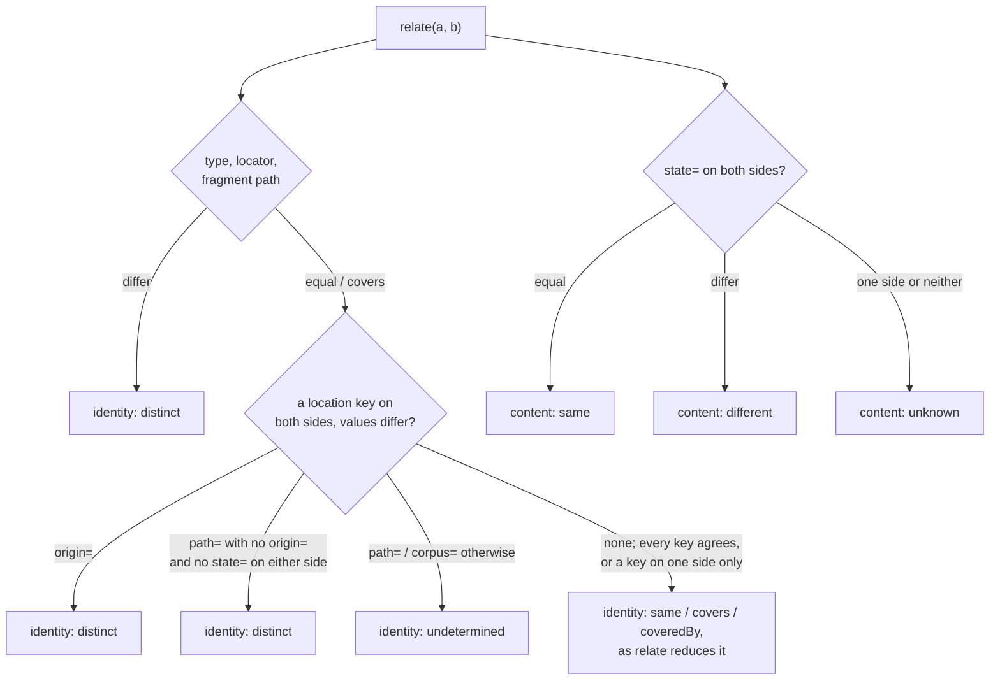

<!--
 Copyright (c) 2026 Danilo Borges (https://github.com/daniloborges)

 Licensed under the Apache License, Version 2.0 (the "License");
 you may not use this file except in compliance with the License.
 You may obtain a copy of the License at

 https://www.apache.org/licenses/LICENSE-2.0
-->

# ADR-0006: Location enters the identifier as a hint, never as identity

| Field | Value |
|---|---|
| Status | Accepted |
| Date | 2026-09-26 |
| Deciders | Danilo Borges |

---

## Context

The specification says a `folder` corpus is "declared by one line in the repository configuration, per
subtree, nearest ancestor wins", and it names no file, no format and no key. Nothing implements it. The
`identify` skill fills the gap by taking the corpus name from the base name of a directory — the one thing
the reference says a corpus **MUST NOT** be derived from. Measured against this repository on 2026-09-26:

- `crates/ref-id/README.md` and the root `README.md` both mint `ref:folder:ref-id/README.md#x`, because the
  repository, the npm package and the crate all live in directories named `ref-id`.
- The same file minted from a second worktree comes out as
  `ref:folder:research-formal-notations/../../../docs/reference/the-ref-scheme.md#Percent-encoding` —
  another name, and a path that climbs out of it.
- `parse("ref:folder:a/../../etc/passwd")` returns `ok`. The `folder` pattern admits `.` and `..` segments
  in the middle of a locator; `url` already refuses a segment that opens on `.`, for the traversal reason
  its own entry gives.

A declaration file does not fix this without breaking what the scheme promises. An identifier is shared
alone — pasted into a record, a message, a reading — and a file it depends on does not travel with it.
A single configuration at the repository root has the same defect, and maps subtrees by path besides.

Two rules stand in the way of the obvious repair:

- `roles.note` in the specification: *location is how a reader reaches the bytes from OUTSIDE the
  identifier, and it never enters one.*
- `why-a-declared-name.md`, *A corpus derived from the filesystem, the repository, or the remote* —
  marked **Does not reopen**. Its three failures are real: a machine's layout, a repository with no
  remote, and the same content live under two corpora through a `file:` link.

Both rules assumed that whatever an identifier carries is identity, compared byte for byte. Prior art that
names things without a registry separates the two instead. A SWHID's core is its identity, and `origin=`,
`path=` and `anchor=` are context qualifiers that do not change what it identifies. A Package URL carries
`vcs_url=` and `repository_url=` beside its name. PEP 610 records a URL, a commit and a subdirectory. A
macOS bookmark keeps several hints and tries them in order.

## Decision

We will admit location into the identifier as a **hint**: a qualifier whose role is `location`, which says
where to search and never decides by itself what is named. Identity stays what `roles.identity` lists —
type, locator, fragment path.

**Three location qualifiers**, each at most once, tried by a reader in the order written here:

| Qualifier | Value | Conflict between two identifiers |
|---|---|---|
| `path=` | a local path opening on a template token, or a path outside every token | `undetermined` — one corpus lives in many clones; `distinct` only when neither side carries `origin=` or `state=` |
| `origin=` | an `https` URL of the repository, credentials stripped, SSH remotes rewritten | `distinct` — two authorities |
| `corpus=` | where the name's declaration lives: a path relative to the root the other hints reach, or a nested `ref:` | `undetermined` — two declarations may point at the same file |

**`path=` opens on one of five tokens**, a closed set that moves only with the specification version:

| Token | Linux | macOS | Windows |
|---|---|---|---|
| `~` | `$HOME` | `$HOME` | `%USERPROFILE%` |
| `{tmp}` | `$TMPDIR` or `/tmp` | `$TMPDIR` | `%TEMP%` |
| `{config}` | `$XDG_CONFIG_HOME` | `~/Library/Application Support` | `%APPDATA%` |
| `{data}` | `$XDG_DATA_HOME` | `~/Library/Application Support` | `%LOCALAPPDATA%` |
| `{cache}` | `$XDG_CACHE_HOME` | `~/Library/Caches` | `%LOCALAPPDATA%\Temp` |

A builder **MUST** rewrite a path under the user's home or temporary directory to its token, so a user
name never reaches an identifier. A path outside every token passes verbatim — `path=c:/windows` for a
file whose identity is its place. That form is admitted and not encouraged; the verdict below is what
discourages it, because it binds only when nothing stronger is present. The separator is `/`, a drive
letter is lowercase, a trailing separator and relative paths are refused, and a `.` or `..` segment is
refused rather than resolved — in `path=` and, by the same change, in the `folder` locator.

**`verdict(a, b)` reads `relate(a, b)` and returns two independent axes:**

```text
identity:  same | covers | coveredBy | distinct | undetermined
content:   same | different | unknown
decidedBy: the dimensions or qualifier keys that fixed each axis
```



The two axes answer different questions and neither overrides the other. The same name with the same
`state=` is the strongest reading of one file. Two names with the same `state=` is a duplicate under two
names. One name with two `state=` values is one living thing at two moments. `covers` becomes a reading of
the identity axis; `samePackage` keeps its narrower meaning over versioned `pkg` locators.

**The `folder` name is a claim made by whoever writes the identifier.** The sentence *declared by one line
in the repository configuration* leaves the specification. A declaration may still exist — a package
manifest that declares a name, or a record reached through a nested `ref:` — and an identifier points at it
through `corpus=` rather than depending on it.

## Options considered

- **Option A — A marker file per subtree** — resolves "nearest ancestor wins" the way a package manifest
  does; rejected because the identifier stops being self-contained: the file must travel with every copy
  of the identifier, and it does not.
- **Option B — One configuration at the repository root** — every name in one place; rejected for the same
  reason as A, and because it maps subtrees to names by path, which reintroduces the dependence the
  reference forbids.
- **Option C — A key inside an existing manifest** — no new file; rejected because `folder` exists exactly
  where no manifest reaches.
- **Option D — Location outside the identifier, in the envelope or as an argument to a search** — keeps
  `roles.note` intact; rejected because an identifier handed over alone then carries nothing a reader can
  start from.
- **Option E — Every location qualifier compared like any other** — no new role; rejected because two
  checkouts of one repository at two local paths would become two identities, which is the failure
  measured above, returning by a different door.
- **Option F (chosen) — Location qualifiers with a role of their own, weighted by a verdict** — the
  identifier stays self-contained and shareable, and a hint narrows where to look without deciding what
  is named. It costs a new relation every port must implement identically, and a claimed name that two
  writers can choose alike.

## Consequences

**`roles.note` changes meaning, and the rejection it rested on is answered rather than reopened.** The
three failures recorded under *A corpus derived from the filesystem, the repository, or the remote* each
assumed the derived name was the whole identity. Under this decision:

- a machine's layout reaches only `path=`, whose conflict is `undetermined`;
- a repository with no remote writes no `origin=` and falls back to `path=`, or to the bare claim;
- the same content under two corpora through a `file:` link is exactly what the content axis reports, as
  `content: same` under two names.

A tool **MAY** therefore offer a default name derived from a remote or a directory, provided it reports
the name as claimed and records the hints it used. The name is still never the only thing that decides.

**Easier:** an identifier minted from a worktree, a clone or a second machine relates to the original
instead of colliding with or diverging from it. Duplicates are found by content without a registry.
Traversal is refused at the grammar, in every port at once.

**Harder:** every port gains `verdict` and must agree with the others on every vector. Two writers who
claim the same `folder` name with no hint are `undetermined`, not distinct — the scheme promises nothing
more for a name nobody proves. A private repository's `origin=` exposes its organisation and name to
whoever receives the identifier; a minting tool has to say so rather than decide silently.

Follow-up work: the specification's `qualifiers`, `roles`, `dispatch.folder` and `comparison` blocks with
their vectors; `verdict` in the three ports; `identify`'s `mint`; the explanation's rejected-alternatives
section, which gains a pointer to this record.

## Related

- ADR-0001 — the specification is one data file the package consumes; every rule above lands there first.
- `docs/explanation/why-a-declared-name.md` — *A corpus derived from the filesystem, the repository, or the
  remote*, answered in Consequences.
- Plan-006 — carries this decision out.
