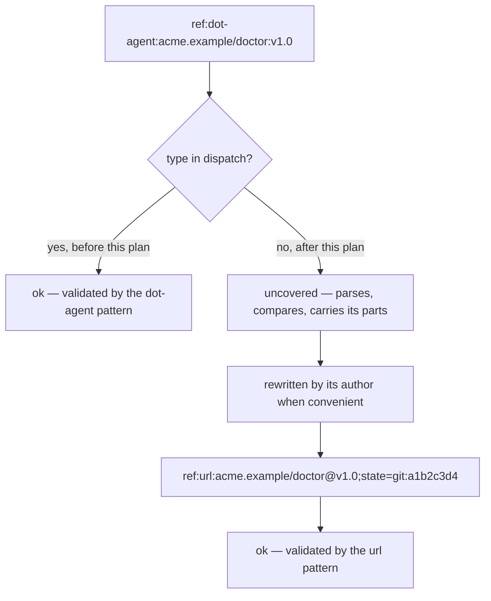
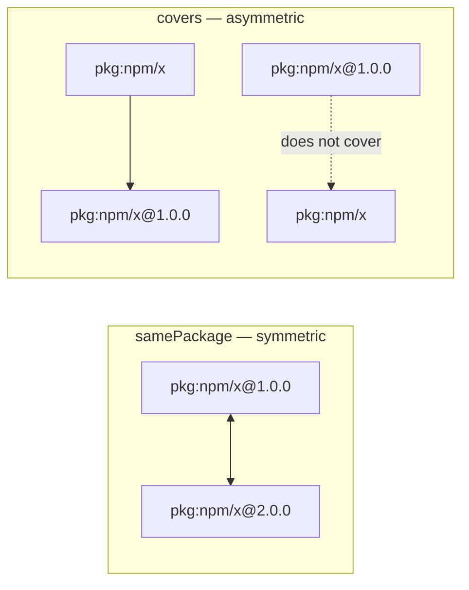

<!--
 Copyright (c) 2026 Danilo Borges (https://github.com/daniloborges)

 Licensed under the Apache License, Version 2.0 (the "License");
 you may not use this file except in compliance with the License.
 You may obtain a copy of the License at

 https://www.apache.org/licenses/LICENSE-2.0
-->

# Plan-002: The types that cannot be contested

| Field | Value |
|---|---|
| Status | In Progress |
| Created | 2026-09-15 |
| Author | Danilo Borges |
| Depends on | Plan-001 |

---

## Summary

A locator type names a naming system, and the registry that admits one is a place worth fighting over. A
type named after a product — a tool, a framework, a company's own vocabulary — invites exactly that fight,
and the party who wins it is whoever is larger rather than whoever is right. This plan settles the
question by adopting an admissibility test and then applying it to the registry as it stands: `dot-agent`
leaves, `domain` becomes `url`, and four types enter whose names an unrelated party solving the same
problem would have chosen identically — `unknown`, `tel`, `isbn` and `gtin`. Two comparison operations
land beside them, because a scheme that can say two identifiers name the same released thing at different
versions is the one a store can query by prefix. The scheme stays at version 1 throughout: every
identifier written against the old registry keeps parsing, as `uncovered`, which is the landing this
scheme was designed to have.

## Goals

1. A written admissibility test that refuses a product name and admits a naming system, applied in the
   specification and in the procedure that registers a type.
2. A registry of nine types, each carrying an authority a third party can verify: a package registry, a
   host owner, a mailbox provider, a serving process, a standards body, or none at all.
3. Every identifier written against the current registry still parses after the change — degraded to
   `uncovered` where its type left, never `malformed`.
4. Two comparison operations, `samePackage` and `covers`, with conformance vectors binding the asymmetry
   between them.
5. The three implementations agree on all of the above, proven by the same vectors.

## Scope

### In scope

- `spec/ref-id.json`: the `dispatch` table, the admissibility clause in `typeRegistry`, the new
  comparison section, and the vectors binding each.
- `packages/ref-id`: the two comparison operations and the two check-digit validators.
- The Swift and Rust ports, held to the same vectors.
- `docs/explanation/`: why the registry is small, and what to reach for when a type is not in it.
- The `identify` skill's type-registration step, which gains the test as its first question.

### Out of scope

- **A resolver.** `resolutionStates` stays a vocabulary a consumer records against; nothing in this
  package fetches anything. That is a separate decision and a separate plan.
- **Normalisation of a locator.** A caller writes the canonical form of its format. A telephone number
  with visual separators, or a book number with hyphens, is refused rather than repaired — the existing
  rule that a locator reaches its validator verbatim is not reopened here.
- **The consumers' own migration.** Which identifiers a consuming store rewrites, and when, belongs to
  that store. This plan changes what the scheme accepts; it schedules no rewrite anywhere else.

## Design

The registry answers one question — *who says this name is this thing?* — and the nine types are nine
answers to it. Reading the table as authorities rather than as categories of thing is what makes the set
feel closed rather than arbitrary.

| Type | The authority | Locator | Validator |
|---|---|---|---|
| `pkg` | a package registry | Package URL | delegated |
| `url` | whoever owns the host | `host(/segment)*(@version)?` | pattern |
| `email` | whoever runs the mailbox | addr-spec | pattern |
| `folder` | nobody — the subtree is local | a declared name | pattern |
| `ai-model` | the process serving the model | the served id, verbatim | pattern |
| `unknown` | outside this registry; the species says where | `species:name(@version)?` | pattern |
| `tel` | ITU-T, through E.164 | `+` and up to 15 digits | pattern |
| `isbn` | ISO, through 2108 | 10 or 13 digits | pattern and check digit |
| `gtin` | GS1 | 8, 12, 13 or 14 digits | pattern and check digit |

### The admissibility test

A type is admissible when **an unrelated party solving the same problem would have chosen the same name**.
`email`, `domain`, `pkg` and `ai-model` pass, because nobody claims those words. A product name fails,
because the claim is the whole point of it. A short desirable word — the name of a general activity that
many parties would want — fails for the opposite reason: several would choose it and none owns the
grammar.

The registry's own text already says half of this: a type names *the naming system that owns the locator
grammar*. What it lacks is the contestability half, and that half is what refuses a type whose grammar
nobody outside the proposer has published.

### The type that defers its species

`unknown` is the registry's escape hatch and the reason the other eight can stay small. Its locator
carries an optional species — `unknown:doi:10.1000/182`, `unknown:orcid:0000-0002-1825-0097` — so an
authority this registry does not cover is still named precisely rather than opaquely. Promotion later is
registering that species as a type of its own, and the written identifier does not change; only its
status moves from `uncovered` to `ok`.

The species separator is a colon, and it is safe there for a reason that does not hold at the top level:
the outer type is fixed, so the locator's own grammar owns every colon inside it. At the top level a
second colon competes with Package URL and with the served model ids that already carry one as data.

### How an identifier survives a type leaving the registry

Nothing in that path throws, and nothing loses a byte. The guardrail that an unknown type degrades rather
than fails is what makes removing a type an ordinary edit instead of a breaking change, and it is why the
scheme stays at version 1 through all of this.

### The two comparisons, and why one is not enough

Equality is byte-for-byte on the canonical form, and it stays that way — the set digest and the envelope
depend on it. Beside it go two relations that equality cannot express:

`samePackage` answers *are these two the same released thing?* — it ignores the version and nothing else.
`covers` answers *is the first the second with less declared?* — a locator without a version covers every
version of it, a locator without a fragment covers every declared name inside it, and a locator without a
qualifier covers every value of it. The direction matters: the general covers the specific, never the
reverse.

`covers` is the query primitive. A store keyed by identifier answers "every reading of this trait" by
asking which of its keys the partial identifier covers, with no query syntax at all — the partial
identifier is the query.

### The `url` segment, and the character it must refuse

A path segment of a `url` locator admits any character except `/`, `@`, `;`, `#` and **`:`**. The four
exclusions are structural. The fifth is the one that took measurement to settle, and it buys a loud
refusal: an agent identifier written in its own format carries its version after a colon and its digest
after a tilde, and a segment that admits the colon accepts that string whole, silently, with the version
and digest inert inside a name. Refusing the colon turns that into an error the author can see, and the
tilde then costs nothing to admit — a digest never appears without the colon that precedes it, so a
tilde alone is an ordinary character in a username.

## Tracks

- [x] **Track 1 — The registry and its test.** Rewrite `dispatch` in `spec/ref-id.json`: `domain` becomes
      `url` with the new segment, `dot-agent` leaves, and `unknown`, `tel`, `isbn` and `gtin` enter. Add
      the admissibility clause to `typeRegistry`. Add the vectors binding each new grammar and each
      refusal, including the four agent-identifier tiers re-expressed under the new types. Reseal. At the
      end the specification declares nine types and refuses a tenth for a stated reason.
- [x] **Track 2 — The two comparisons.** `samePackage` and `covers` in `packages/ref-id`, with a vector
      group of their own binding the asymmetry — the general covers the specific, and the specific does
      not cover the general. At the end the reference implementation answers both and the vectors fail if
      either direction flips.
- [x] **Track 3 — The check digits.** `isbn` and `gtin` validate their check digit rather than only their
      shape, which makes them the first types whose validator computes. The algorithm is a weighted sum
      and adds no dependency. At the end a number with a correct shape and a wrong check digit is
      refused, with a vector proving it.
- [x] **Track 4 — The Swift port.** Held to the same vectors, gated by `swift run ref-id-conformance`.
- [x] **Track 5 — The Rust port.** Held to the same vectors, gated by `cargo test --workspace`.
- [x] **Track 6 — What earns a type.** A page under `docs/explanation/` carrying the test, why the
      registry is deliberately small, and what to reach for when a type is not in it. The
      type-registration step of the `identify` skill gains the test as its first question.
- [ ] Run `/vibe-ops:close-plan` — retrospective against the goals, the demotion check, the tracking
      issue closed. The plan file itself is kept.

## Success criteria

- `node scripts/seal-spec.mjs` runs clean and `npm test` passes with the new vector groups present:
  `samePackage` and `covers` each have vectors, and each new type has both an accepting and a refusing
  vector.
- Every identifier from the current conformance corpus still parses. Specifically, an identifier whose
  type left the registry reports `uncovered`, and no input that reported `ok` before reports `malformed`
  after.
- `swift run ref-id-conformance` and `cargo test --workspace` pass against the same
  `spec/ref-id.json`, with no port carrying a table the specification does not.
- A number whose shape is right and whose check digit is wrong is refused by `isbn` and by `gtin`, in all
  three implementations.
- `covers` refuses the reverse direction: a versioned locator does not cover its unversioned form, and a
  vector fails if it does.
- `./scripts/check.sh` exits `0`.

---

<!-- ===== LIVING SECTIONS — maintained during the work, not written at the end ===== -->

## Decision Log

- Decision: the scheme stays at version 1 through the whole registry change, and a type leaving the
  registry is an ordinary edit rather than a breaking one.
  Rationale: an unregistered type degrades to `uncovered` by a guardrail this repository already holds,
  so an identifier written against the departing type keeps parsing, keeps its parts and stays
  comparable. The versioning rule mints a major for normalisation, percent-encoding, separators or shape,
  and none of those moves here. What changes is which grammar validates a locator, which is exactly what
  `uncovered` exists to absorb.
  Date / Author: 2026-09-15 / Danilo Borges

- Decision: the ports and the explanation pages may be delegated to a subagent; the specification, the
  reference implementation and any consumer's reshape may not.
  Rationale: a port is a mechanical translation under a closed contract — the vectors say what correct
  means, and a gate runs them — which is the shape delegation is cheap for. The specification is the
  contract three implementations agree on, and the two comparison operations carry an asymmetry that a
  reader can get backwards; one such relation was written wrong during this plan's own exploration and
  was caught by a test rather than by review. A judgement that has to agree with this plan's intent stays
  where the intent is.
  Date / Author: 2026-09-15 / Danilo Borges

- Decision: a locator is written in its format's canonical form, and a non-canonical spelling is refused
  rather than repaired.
  Rationale: a telephone number with visual separators and a book number with hyphens are both legal in
  their own standards and both normalise to a single canonical string. Repairing them here would make
  this scheme a normaliser for every format it delegates to, and the existing rule is the opposite: a
  locator reaches its validator verbatim, because a format's own encoding belongs to that format. The
  refusal is loud, which is the property the `url` segment decision also chose.
  Date / Author: 2026-09-15 / Danilo Borges

- Decision: a `url` path segment refuses the colon and admits the tilde.
  Rationale: measured against the agent identifiers, package corpora and conversation stores this scheme
  is meant to name, a segment refusing the colon was the only variant of five that made no error — it
  accepted every identifier that should be accepted and refused every unconverted form. The permissive
  variant accepted the unconverted form and buried its version and digest inside a name, which is worse
  than a refusal because nothing reports it. The tilde is safe alone because a digest never appears
  without the colon that introduces it.
  Date / Author: 2026-09-15 / Danilo Borges

- Decision: a type stays a single token; an identifier nested as the type — `ref:<identifier>:<rest>`,
  so that the authority is itself named under the scheme — is refused.
  Rationale: it solves the right problem the wrong way. The competition it targets is real, and the
  admissibility test above removes it for a clause rather than for a grammar change. Measured against the
  reference implementation, the nested form already parses today and parses wrongly: the type group
  admits no colon and the locator admits every colon, so a second colon is absorbed into the locator and
  the result is `ok` with the authority and the thing fused into one opaque string. A form that is
  already valid syntax with a different meaning cannot be given a new one without breaking what reads it
  that way — and two registered types, Package URL and the served model identifier, carry a colon as data
  today. Escaping the colon to delimit it produces a percent-encoded authority, which is less legible
  than the plain host the `url` type already offers.
  Reopens if a type appears whose authority cannot be expressed as a host, a registry, a mailbox or a
  declared species — none of which was found while surveying the corpora this scheme is meant to name.
  Date / Author: 2026-09-16 / Danilo Borges

- Decision: `uuid` is not a type; an opaque machine-minted identifier is named by the authority that
  minted it, with the identifier itself as the declared name in the fragment.
  Rationale: two products can mint the same opaque value, so a type whose only promise is "this has no
  authority" makes them collide. Prefixing with the minting authority separates them, costs nothing that
  the scheme does not already have, and puts the value where the grammar already expects a declared name.
  Date / Author: 2026-09-15 / Danilo Borges

- Decision: `email` keeps its declared property that nothing lives under a mailbox, and the agent
  identifier tier that would have needed a path has no destination until something real uses it.
  Rationale: the tier exists in documentation and in test vectors and nowhere else — every agent
  identifier found on disk names a host. Reversing a declared property of the scheme to serve a tier with
  no user spends the property and buys nothing. If such an identifier appears, the reversal is a small
  edit with a real case behind it.
  Date / Author: 2026-09-15 / Danilo Borges

- Decision: whether a locator carries a version is declared per type, as `dispatch.<type>.versionTail`,
  rather than inferred from the punctuation.
  Rationale: the first implementation read an `@` as a version wherever it found one, and an `@` means
  four different things across the nine types — a released version in a Package URL and a host path, the
  separator between a mailbox and its domain, a quantisation key on a served model, and nothing at all in
  a telephone or article number. Measured: two different mailboxes compared equal, and two quantisations
  of one model collapsed into one. Declaring it in the specification also gives the ports something to
  read instead of a rule each would re-derive.
  Date / Author: 2026-09-16 / Danilo Borges

- Decision: a `url` path segment may not open on `.`, which excludes `.` and `..`.
  Rationale: widening the segment to refuse the colon dropped, as a side effect, a property the previous
  pattern had — that a segment opens on an alphanumeric — and with it the refusal of a path traversal.
  The served-model entry in the same table already argues why that matters: the delegate is verbatim, so
  a consumer mapping a declared name onto a path inherits whatever the locator carried. Three variants
  were measured against the corpus of real agent identifiers and hosts; excluding `.` at the head of a
  segment was the only one with no error, refusing every traversal while still admitting a platform
  whose usernames open on a character no allowlist would have predicted.
  Date / Author: 2026-09-16 / Danilo Borges

- Decision: a relation refuses an identifier whose parts this implementation did not produce — `malformed`
  and any scheme version it does not support — and compares the scheme version as a dimension.
  Rationale: a later identifier version is minted for a change to normalisation, percent-encoding,
  separators or shape, which is exactly the set of changes that make a locator decomposed by the wrong
  expression unreliable. Measured: a v1 and a v2 identifier compared equal under both relations while
  `sameIdentifier` refused the same pair, so two neighbours in one module disagreed about the same two
  strings.
  Date / Author: 2026-09-16 / Danilo Borges

## Outcomes & Retrospective

**2026-09-16 — all six tracks landed; the review found what the vectors did not.** The registry is nine
types, the two relations exist, and the three implementations pass their own gates. Backward
compatibility was measured rather than asserted: every identifier in the previous specification's vector
corpus was re-parsed against the new one, and thirteen moved from `ok` to `uncovered` while **none**
became `malformed` and none threw.

**What the process taught, and it is the same lesson twice.** Three defects were found by probing the new
types by hand before any vector existed for them, and four more by an adversarial review after the suite
was green — a validator declared in the specification that no implementation had, a delegation mode whose
pattern could never match, a relation blind to fragment refinements, and a version heuristic that read
four different meanings of `@` as one. Every one of them passed every gate. **A behaviour with no vector
is a behaviour whose failure is silent**, and the suite's green is exactly as wide as the vectors, never
wider.

The comparison vector group exists now, and was checked against the defect rather than against the fix:
six of its seventeen vectors fail when run against the relation as it was first written. A vector that
cannot fail is the check that feels like verifying and is not.

**Still open, and named rather than quietly dropped:** the two relations live only in the reference
implementation. Goal 5 asks the three implementations to agree, proven by the same vectors, and the ports
have nothing to compare yet. Worse, and found while checking that: each port's runner names the vector
groups it runs by hand, so the `comparison` group was added to the specification and both ports stayed
green without running a single one of its vectors. A group no runner names is a group that never runs, in
every implementation at once — which is the same defect as an unvectored behaviour, one level up.

<!-- ===== END LIVING SECTIONS ===== -->

---

## Open questions

- Whether `isbn` earns its place beside `gtin`. A 13-digit book number is a GTIN-13, so the two overlap
  entirely there and diverge only at the 10-digit form the older standard still uses. The case for
  keeping both is that a reader who has an ISBN should not have to know it is also a trade item number;
  the case against is a second type for one length of one number.
- Whether the species inside `unknown` should be held to a declared list or left open. Open means a
  typo becomes a species nobody notices; declared means the registry grows the contested surface this
  plan exists to shrink, one layer down.

## Related

- Plan-001 — the package and the scheme it implements.
