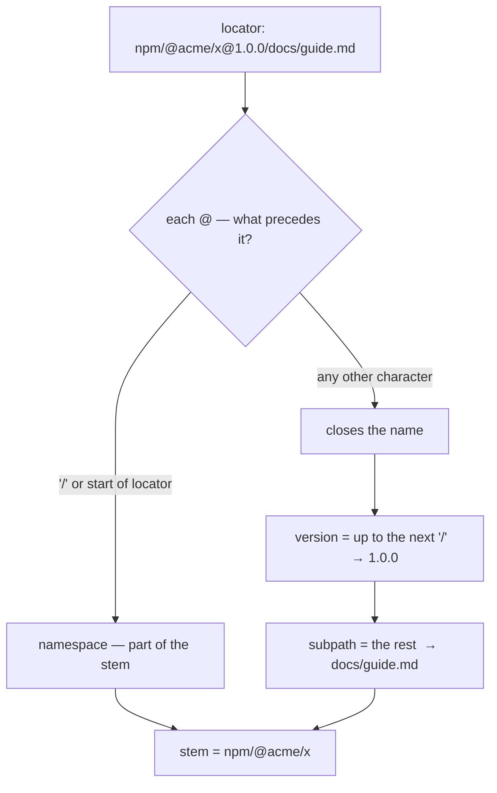

# Plan-003: The locator carries the path, and the fragment cuts one level

| Field | Value |
|---|---|
| Status | In Progress |
| Created | 2026-09-17 |
| Author | Danilo Borges |
| Related | Plan-001 (shipped), Plan-002 (shipped), ADR-0001 |

---

## Context

Minting identifiers for a documentation corpus produced a set that is wrong in a way the parser
cannot see. Every identifier named the same corpus with a different `state=`:

```text
ref:folder:acme-tools;state=sha256:a2153e88…#docs/guide.md/Setup
ref:folder:acme-tools;state=sha256:3d79736c…#README.md
ref:folder:acme-tools;state=sha256:9bc1dff7…#docs/api.md/Overview;item=1
```

A corpus does not have three states at once. Each digest is of one file, hung on the corpus because
the corpus is the only place `state=` parses — measured: `state=` on the fragment side returns
`malformed`, including in the SWHID forms this repository's own reference documentation shows.

Three defects sit under that, and they share one cause. The identifier names the **corpus** and the
fragment names everything below it, so there is no position that means *this file*.

1. **Declared names collide across files.** `fragmentGrammars.markdown` declares
   `tieBreak: "ordinal on collision within one document"` — there is no tie-break *between*
   documents. `## Overview` in `docs/guide.md` and `## Overview` in `docs/api.md` both mint
   `ref:pkg:npm/acme-tools#Overview`.
2. **Per-file state has no position.** `state=` is a qualifier, qualifiers sit before the `#`, and
   what sits before the `#` is the corpus.
3. **The skill forbids what the specification permits.** `.agents/skills/identify/SKILL.md:31` says
   *"a file path inside an identifier is the defect this separation exists to catch"*, while
   `spec/ref-id.json` calls the fragment's own path the *"declared-name path"* and ten conformance
   vectors use `#AGENTS.md`. `identify.ts mint` implements the skill, not the specification.

The intended outcome: the `#` cuts exactly one level below what the locator names, and what that
level is depends on the type of the item being cut — `folder#file`, `file#heading`, `image#pixel`,
`sentence#word`. Descending a level pushes the previous one into the locator, so an identifier
always carries exactly one cut, and choosing where to cut is choosing what is being named.

Nothing downstream is broken by doing this now. **No identifier minted under this scheme is
persisted by any consumer**: the one production consumer computes identifiers where a reader needs
one and stores none, on the ground that storing a derived projection grows an append-only file
without adding bytes that were not already there. It declares `^0.3.0`, reaches this package through
a single module, and guards that entrance with a test that fails the build if any other module
imports the package or hand-rolls the identifier shape.

## Goals

1. `ref:folder:acme-tools/docs/guide.md#Setup` and `ref:pkg:npm/x@1.0.0/docs/guide.md#Setup` both
   parse, and `;state=` on either is a claim about that file rather than about the corpus.
2. `covers` relates a corpus to the files under it: `folder:acme-tools` covers
   `folder:acme-tools/docs/guide.md`, and does **not** cover `folder:acme-tools-extra`.
3. A `pkg` locator carrying a path converts to a Package URL by a written rule, with the fragment
   named as the declared loss.
4. Every rule that is true of one type only lives in that type's `dispatch` entry.
5. The `identify` skill and `mint` stop refusing a path, and mint the file-level identifier by
   default for a corpus read as a tree.
6. The scheme stays at v1 with no explicit version token: nothing below changes a separator or the
   shape, which are the only two things `version.mints` declares as minting a new version.

## Scope

### In scope

- `spec/ref-id.json`: the `dispatch` entries for `folder` and `pkg`, the `comparison` block, the
  removal of `fragmentGrammars`, and the vectors that bind all of it.
- The three implementations of the comparison algorithms — TypeScript, Rust, Swift.
- `docs/reference/the-ref-scheme.md` and the two explanation pages.
- `.agents/skills/identify/SKILL.md` and `.agents/skills/identify/scripts/identify.ts`.

### Out of scope

- **A second `#`.** The grammar has one, and the level below the cut is already served by the
  refinements (`lines=`, `item=`, `para=`), which the specification describes as *"which part"*.
- **`state=` on the fragment side.** With the file in the locator it is no longer needed, so the
  qualifier/refinement partition at `packages/ref-id/src/parse.ts:186-198` stays as it is, with
  both vectors that guard it.
- **A root registry** — a short corpus name resolving to a location on a particular machine. A
  path-derived corpus was measured wrong in `docs/explanation/why-a-declared-name.md:189-197`; the
  registry belongs outside the identifier, which `dispatch.folder.declaredBy` already describes.
- **Migrating minted identifiers.** None are stored anywhere.

## Design

### The locator carries the path

`folder` today declares `pattern: "^[A-Za-z0-9][A-Za-z0-9._-]*$"` and its validator is one line —
`packages/ref-id/src/validators.ts:27` tests that pattern and nothing else. Widening the pattern to
`^[A-Za-z0-9][A-Za-z0-9._-]*(/[A-Za-z0-9._-]+)*$` is the whole change for that type; measured
against the real parser with the sidecar re-sealed, `ref:folder:acme-tools/docs/guide.md#Setup`
returns `ok` and `ref:folder:acme-tools/docs/` stays `malformed`.

`pkg` delegates its locator to the Package URL validator, and there the path and the version fight
over the same `@`. Measured today:

| Input | Result |
|---|---|
| `npm/x@1.0.0/docs/guide.md` | canonical `pkg:npm/x@1.0.0%2Fdocs%2Fguide.md` — the path became part of the version |
| that vs `npm/x@2.0.0/docs/guide.md` | `samePackage: false` — two versions of one file are not one package |

The cause is the guard at `packages/ref-id/src/relations.ts:29`, written for `npm/@acme/x` where the
`@` opens a namespace segment rather than closing the name. The rule that serves both, and is the
core of this track:

> An `@` preceded by `/`, or at the start of the locator, **opens a segment** and is part of the
> name. An `@` inside a segment **closes the name**; the version runs from it to the next `/`, and
> everything after that `/` is the subpath.



Three decompositions this must produce, each already present as a conformance vector or implied by
one: `npm/@acme/x` → stem only; `npm/@acme/x@1.0.0` → stem `npm/@acme/x`, version `1.0.0`;
`npm/x@1.0.0/docs/guide.md` → stem `npm/x`, version `1.0.0`, subpath `docs/guide.md`.

The Package URL conversion then becomes a written rule instead of an identity: the subpath moves to
purl's own `#subpath`, which is what that component means, and the `ref:` fragment has nowhere to
go and is declared lost.

```text
ref:pkg:npm/x@1.0.0/docs/guide.md#Setup   →   pkg:npm/x@1.0.0#docs/guide.md   (fragment lost)
ref:pkg:npm/x@1.0.0                       →   pkg:npm/x@1.0.0                 (identity, as today)
```

The build side keeps refusing a `#` inside a locator — the vector *"a locator carrying a reserved
character is refused"* stays true, because the subpath now arrives as `/`, never as `#`.

### `covers` compares the stem by segment prefix

`comparison.covers` requires *"the locator stems must be equal"*, so with the path in the locator a
corpus stops covering its own files — measured `false` for `folder:acme-tools` against
`folder:acme-tools/docs/guide.md`. The stem comparison becomes a **segment prefix**: A covers B when
B's stem equals A's stem, or begins with A's stem followed by `/`.

**The segment boundary is the whole of it.** A raw string prefix would make `folder:acme-tools`
cover `folder:acme-tools-extra`, which is `false` today and must stay so. An existing vector is the
witness: the uncovered-type pair `<type>:trait` vs `<type>:trait@1` expects `covers: false`, and a
raw prefix inverts it because `trait@1` starts with `trait`. Both pairs become vectors of their own
rather than staying implicit.

With the segment boundary, **all 17 existing comparison vectors pass unchanged** — the relation only
widens, so no `true` becomes `false`.

This is the one change that is not a string: the comparison algorithms are hand-ported per
language and each restates the same logic — `packages/ref-id/src/relations.ts:97,104`,
`crates/ref-id/src/relations.rs:100,107`, `Sources/RefId/Relations.swift:76,80`. Three edits, one
per implementation, bound by the same vectors.

### The specification reorganises by type

Seven blocks of `spec/ref-id.json` are read by no line of the package: `roles`, `fragmentGrammars`,
`comparison`, `identifierEquivalence`, `stateLevels`, `resolutionStates`, `typeRegistry`. The
comparison rules live in code and meet the specification only through the vectors. Moving text
nothing reads breaks nothing, which is what makes this track cheap.

- `comparison.samePackage` carries the name of one type and runs on all nine; for `folder` it is
  equality by another name. It becomes a per-type declaration in `dispatch`, so a type says whether
  it has a version dimension at all.
- `qualifiers` splits: `state=` is meaningful for every type, while `by=`/`over=`/`when=` describe a
  reading. Which qualifiers a type admits is declared in its `dispatch` entry.
- `fragmentGrammars` leaves the specification for `docs/reference/the-ref-scheme.md`. The scheme does
  not interpret the type of the item being cut — it hands over what it can, and the implementer
  finds the rest. What stays normative for `folder` is the minimum: the locator ends at a file, the
  fragment is a name inside it, and the scheme says nothing about which.

### The skill stops being stricter than the specification

`SKILL.md:31` is deleted and replaced by the level rule. `roles` in the specification is where that
sentence came from — it lists `fragment.path` under `identity` and `path` under `location`, two
things called *path* in opposite roles with nothing to tell them apart. The distinction becomes
sayable: identity is **where the cut was made**; location is how a reader got there from outside the
identifier.

`identify.ts` currently reads `--fragment` and discards the path
(`.agents/skills/identify/scripts/identify.ts:164,213`). It gains the file: for a corpus read as a
tree, `mint --path` produces `ref:folder:<corpus>/<path>#<declared name>` rather than hanging the
name on the corpus.

One further contradiction in that file is corrected in the same pass, found while measuring: the
skill states that the conditions a reading was taken under are attributes that get no identifier,
while `by=`, `over=` and `when=` are exactly those conditions and sit inside the identifier. They
are what individualise a reading, so they belong to its name — measured, a partial `;over=<digest>`
covers the reading over that population and refuses the reading over another, which is a
discriminant and not a description. The attribute is the *result*, and that stays outside.

## Tracks

- [x] **Track 1 — The locator carries the path.** Widen `dispatch.folder.pattern`; implement the
      segment rule for `@` in the `package-url` validator and in `split()` so a `pkg` subpath is not
      swallowed by the version; re-seal the spec with `node scripts/seal-spec.mjs` and copy the pair
      into both ports. At the end the three decompositions above hold and
      `ref:pkg:npm/x@1.0.0/docs/guide.md` canonicalises without `%2F`. New vectors: the widened
      folder case, the three `@` decompositions, and the inversion of *"corpus name with a path
      separator is malformed"* — the one existing vector this plan revokes.
- [x] **Track 2 — `covers` by segment prefix.** Change the stem comparison in all three
      implementations. Add the two witness vectors (corpus vs a file under it → true; corpus vs a
      sibling corpus whose name merely starts with the same characters → false) and keep the
      uncovered-type pair at false. At the end all 17 existing comparison vectors still pass and the
      two new ones bind the boundary.
- [x] **Track 3 — The Package URL conversion becomes a rule.** Write the subpath mapping and the
      declared loss into `dispatch.pkg` and `docs/reference/the-ref-scheme.md`. At the end there is a
      vector per direction and the documentation states what a purl cannot carry.
- [x] **Track 4 — The specification reorganises by type.** Move `samePackage` and the qualifier
      admissibility into `dispatch`; move `fragmentGrammars` into `docs/reference/the-ref-scheme.md`;
      repoint the five reads of `spec.qualifiers` (`parse.ts:194,202`, `build.ts:18`, `spec.ts:162`).
      Correct `docs/reference/the-ref-scheme.md:222`, which states the prohibition this plan revokes,
      and the folder row at `:202`, the fragment-grammars section at `:491-503` and the qualifiers
      section at `:307`. At the end no rule true of one type sits outside that type's entry.
- [x] **Track 5 — The skill and the mint follow the specification.** Rewrite `SKILL.md:26-33` to the
      level rule; teach `identify.ts mint --path` to put the file in the locator. At the end,
      re-minting a corpus produces one `state=` per file, and the same heading text in two documents
      produces two identifiers.
- [x] **Track 7 — A mailbox is a corpus.** `email` today refuses a path because its locator is an RFC
      5322 addr-spec, and `dispatch.email.declaredBy` states the reason as a claim about the world:
      *"a mailbox identifies a person or a role; nothing lives under it"*. That claim is false — what
      sits under a mailbox is the person's own items, named by whoever serves them, and the scheme
      verifies neither. The correction has the same shape as the `@` rule: the delegated format runs
      to the first `/`, so the validator still receives an addr-spec and the `reference` to RFC 5322
      stays true, while `alguem@dominio.com/<item>#<cut>` names an item under the mailbox and a cut
      inside it. At the end `declaredBy` says what is true, and a vector binds each of the three
      levels. Measured before deciding: the fragment on `email` was never barred —
      `ref:email:someone@mail.example#thread-abc` parses today; only the path was.
- [x] **Track 6 — The differential test that never ran.** *Opened, measured, and larger than this plan.*
      The `--parse` protocol exists in both ports and no script drove it. Instrumenting it was cheap and
      is done: `--canonical` now keeps the field both runners were deleting. What it exposed is not a
      scripting job. The three ports disagree on canonicalisation, measured over six cases — an already
      percent-encoded name double-encodes in Swift (`%2540acme`), a type is not lower-cased there, and
      qualifiers keep their input order. TypeScript and Rust agree byte for byte because both delegate
      to a library; the Swift port validates the Package URL in-house because no maintained Swift
      library exists. Closing this means **deciding the canonicalisation rule in the specification and
      binding each case with a vector**, then implementing it in the Swift port, then writing the
      driver and the CI step. That is a specification question, not the plumbing this track was written
      as, and it belongs in its own record. `Sources/RefIdConformance/main.swift:12-13`
      and `crates/ref-id/examples/parse_lines.rs:3-4` both carry a `--parse` protocol described as
      *"the surface the differential test against the TypeScript reference reads"*, and no script or
      CI job drives it — `.github/workflows/gates.yml` runs the three suites in isolation. This plan
      edits the same hand-ported algorithm in three languages, so the absence is load-bearing now.
      At the end a script drives all three over every vector and CI fails on divergence.
- [ ] Run `/vibe-ops:close-plan`.

## Success criteria

From the repository root:

```sh
node scripts/seal-spec.mjs --check     # the sidecar matches; both port copies identical
npm test                               # all 186 vectors across the 7 groups
cargo test --manifest-path crates/ref-id/Cargo.toml
swift run ref-id-conformance
npm run test:grammar                   # the Python and Perl engines replay vectors.parse
./scripts/check.sh; echo $?            # exits 0
```

Then, against a corpus of documentation files, each minted identifier carries a `state=` that is a
claim about one file, and the same heading text in two documents mints two identifiers:

```sh
node .agents/skills/identify/scripts/identify.ts mint --path docs/guide.md --fragment 'Setup'
# → ref:folder:acme-tools/docs/guide.md#Setup
```

The release is a **minor** bump on the package (0.3.0 → 0.4.0) with `specVersion` 1.3.0 → 1.4.0. The
scheme stays v1: no separator and no shape changes, which are the only two mints `version.mints`
declares. The one production consumer declares `^0.3.0` and must be moved deliberately; its own
entrance test is what will catch any hand-rolled parsing that creeps in behind the change.

---

## Decision Log

- Decision: the scheme stays at v1, with no explicit version token in the identifier.
  Rationale: `version.mints` names exactly two changes that mint a new version — normalisation or
  percent-encoding, and separators or shape. Widening a type's validator, widening a relation and
  moving text between files is none of them.
  Date / Author: 2026-09-17 / Danilo Borges

- Decision: both `folder` and `pkg` admit a path in the locator.
  Rationale: the scheme does not check whether a file exists on disk or whether a package was
  published — it points. Restricting the path to `folder` would make the fragment unusable for a
  piece of a file inside a package, which is the case that produced this plan.
  Date / Author: 2026-09-17 / Danilo Borges

- Decision: `fragmentGrammars` leaves the specification for the documentation.
  Rationale: the scheme does not interpret the type of the item being cut. The table is guidance for
  whoever mints, not a rule any parser applies — no line of any implementation reads it today.
  Date / Author: 2026-09-17 / Danilo Borges

- Decision: the prefix comparison is by segment, never by raw string.
  Rationale: a raw prefix makes a corpus cover a sibling corpus whose name merely starts with the
  same characters, and inverts the existing uncovered-type vector from false to true.
  Date / Author: 2026-09-17 / Danilo Borges

- Decision: in `pkg`, a subpath requires a declared version.
  Rationale: found while implementing Track 1. Without an `@` there is no marker separating the name
  from the path, and `npm/a/b/c` is a valid Package URL naming `c` in the namespace `a/b`. A file in a
  corpus nobody versioned is named through `folder`, whose locator needs no marker.
  Date / Author: 2026-09-17 / Danilo Borges

- Decision: `email` carries a path, and `declaredBy` is rewritten rather than kept.
  Rationale: the prohibition was stated as a claim about the world — *"nothing lives under a
  mailbox"* — and the counterexample is replicable: what sits under it is the person's own items, and
  whether an item's id was minted by a mail provider or by the person changes nothing the scheme can
  check. The delegated addr-spec runs to the first `/`, so RFC 5322 still describes what the validator
  receives.
  Date / Author: 2026-09-17 / Danilo Borges

- Decision: `qualifiers` stays transversal and does **not** move into `dispatch`.
  Rationale: measured while working Track 4, against the plan's own Design section. `state=` freezes
  anything, and `by=`/`over=`/`when=` describe a reading — an `isbn` can be read by an instrument at a
  moment as readily as a `pkg` can. Declaring them per type would copy four entries into nine dispatch
  entries, which is the repetition this track exists to remove, in the other direction. What is genuinely
  of one type is `samePackage`: three of the nine declare `versionTail`, and for the other six the
  relation is equality wearing a borrowed name.
  Date / Author: 2026-09-17 / Danilo Borges

- Decision: `samePackage` keeps its name; only its stated purpose is corrected.
  Rationale: the name is exported from the published package, so renaming it breaks the one production
  consumer for a cosmetic gain. The text is what was asserting of nine types something true of three.
  Reopens if the package takes a breaking release for another reason.
  Date / Author: 2026-09-17 / Danilo Borges

- Decision: the Swift port stays independent rather than binding to the Rust purl crate.
  Rationale: the only Swift Package URL implementation was last pushed in 2021 and has no release, so the
  choice was between writing ~100 lines and calling Rust over a C ABI. Binding would make the two ports
  agree by construction, and the differential test would compare an implementation with itself — the
  defect found in an earlier review surfaced precisely because the readers were independent. It would
  also require cargo at build time or a pre-built XCFramework per platform. The three canonicalisation
  divergences the port does carry are bound by vectors instead, in Track 6.
  Date / Author: 2026-09-17 / Danilo Borges

- Decision: `state=` stays a qualifier and gains no position on the fragment side.
  Rationale: with the file in the locator, the qualifier is already a claim about the file. Admitting
  it on both sides would reopen the partition at `parse.ts:186-198` and the two vectors that guard
  it, for nothing.
  Date / Author: 2026-09-17 / Danilo Borges

## Outcomes & Retrospective

<!-- Filled at each track completion. -->

## What this plan opened and did not close

**The specification declares no public surface.** It has no `operations`, `api`, `surface` or `exports`
key, so "the three ports have the same API" is a claim the README makes and nothing verifies. Comparing
the three by hand found the gaps, and every one of them was **in the reference**: `SpecIntegrityError`
and `SpecVersionError` outside the `RefIdError` hierarchy, no guard that every declared vector group is
executed, and no line-protocol runner — the last of which meant the differential judged the reference by
a path the ports never take. All three are fixed here. What is *not* fixed is the direction: `covers`,
`samePackage`, `digest`, `validateEnvelope` and `sameIdentifier` are missing or differently spelled
across Rust and Swift, and `sameIdentifier` exists only in TypeScript.

Half the mechanism already exists and nobody named it: **the seven vector groups are seven operations**,
and all three ports now assert that every declared group is executed. The gap is that an operation may
exist with no group of its own — `sameIdentifier` lives under `canonical` beside another operation, and
it is precisely the one missing from two ports. A declared mapping from operation to vector group would
have made that absence a failing check rather than a finding.

That is the next record's subject, and the check it needs compares *names and signatures* where the
differential compares *answers* — the two halves of "the same API".

## Open questions

- Track 4 moves qualifier admissibility into `dispatch`, which implies a type may refuse a
  qualifier. Whether an inadmissible qualifier is `malformed` or carried through — as an unknown key
  is today — is undecided, and the two differ for a reader that stores what it does not understand.
