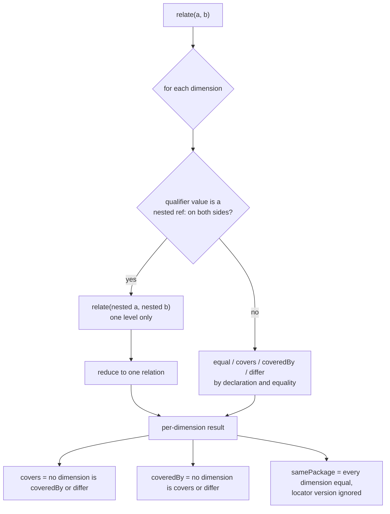

<!--
 Copyright (c) 2026 Danilo Borges (https://github.com/daniloborges)

 Licensed under the Apache License, Version 2.0 (the "License");
 you may not use this file except in compliance with the License.
 You may obtain a copy of the License at

 https://www.apache.org/licenses/LICENSE-2.0
-->

# Plan-005: The comparison descends into nested identifiers

| Field | Value |
|---|---|
| Status | Backlog |
| Created | 2026-09-23 |
| Author | Danilo Borges |
| Related | ADR-0005 (the `ai-model` locator opens on the provider) |

---

## Summary

`covers` and `samePackage` compare a qualifier by byte equality, even when its value is a nested `ref:`
identifier that the same operation could compare. So a store cannot ask *"everything any build of this
engine produced"*: `…;by=ref:pkg:github/ggml-org/llama.cpp` does not cover
`…;by=ref:pkg:github/ggml-org/llama.cpp@b10931`, although the two nested identifiers stand in exactly
that relation when compared directly. This plan makes both operations descend into a nested identifier,
and adds `relate`, an operation that reports the relation in every dimension instead of reducing it to one
boolean. The specification and its vectors change first. The three implementations follow in one
realignment pass, because their code has already drifted apart on other points and is being brought back
in line at once.

## Goals

- `covers(a, b)` is `true` when every qualifier `a` declares is declared by `b` with a value that `a`'s
  value covers. A nested identifier is compared with `covers`, and any other value by equality.
- `samePackage` descends the same way, with `samePackage` on the nested pair.
- A new `relate(a, b)` reports, for each dimension the specification lists in `comparison.dimensions`,
  whether `a` and `b` are `equal`, whether one covers the other, or whether they `differ`. `covers`,
  `coveredBy` and `samePackage` are stated as reductions of that result.
- A vector group binds every rule above, so an implementation that disagrees fails its own suite and the
  differential.
- `main` never holds a specification that one of its implementations cannot run.

## Scope

### In scope

- The `comparison` block of `spec/ref-id.json`: the `covers` and `samePackage` rules, and a new `relate`
  entry.
- Vectors: the existing `comparison` group, and a new `relate` group.
- The TypeScript reference, the Rust crate and the Swift port, including their runners' lists of executed
  groups and the differential in `scripts/differential.mjs`.
- `docs/reference/the-ref-scheme.md` and a changeset.

### Out of scope

- "The same weights through any provider" (`omlx/<repo>` against `mlx/<repo>`). Different first locator
  segments make those two different models by ADR-0005's own rule. A consumer that needs the weights
  compares their `pkg:huggingface` identity instead.
- Nesting deeper than one level. The specification already refuses it at parse time (the vector *"nesting
  deeper than one level is malformed"*), so the recursion is bounded at one step.
- A new marker for "version unknown". `state=none` on the nested identifier already says it:
  `covers(…;state=none, …@b10931)` is `false`, and a query with no version and no state covers both.

## Design

A comparison already splits into the dimensions `comparison.dimensions` names: type, version, locator
stem, locator version, fragment path, fragment refinements, and qualifiers. `relate` computes one relation
per dimension, and for each qualifier key, in a closed set of four values:

| Relation | Meaning for a dimension |
|---|---|
| `equal` | both sides declare it identically, or neither declares it |
| `covers` | `a` is the general side: it leaves the dimension undeclared where `b` declares it, or its stem is a whole-segment prefix of `b`'s, or its nested identifier covers `b`'s |
| `coveredBy` | the mirror of `covers` |
| `differ` | both declare it, and neither side reaches the other |

A qualifier whose value on both sides is a nested `ref:` carries the nested pair's own `relate` result
under `nested`. Its relation is that result reduced by the same rule as the top level. A `sha256:` value,
a timestamp or plain text is `equal` or `differ`.



Three consequences are part of the design, not side effects:

- Results change. A pair `covers` reports `false` for today, like the `by=` vector ADR-0005 added, becomes
  `true`. The change touches no normalisation and no separator, so by this repository's own rule it is an
  addition and ships as `minor`. The changeset still states that a stored comparison result may flip.
- `samePackage` on `by=…@1` and `by=…@2` becomes `true`: the same engine at two releases. That matches
  what `samePackage` already does to a locator version.
- `relate` is the first operation whose output shape the specification declares. The vector group is the
  declaration, and every implementation's runner must list it, or refuse to start.

**Ordering constraint.** The Rust and Swift runners declare the groups they execute
(`crates/ref-id/tests/conformance.rs`, `Sources/RefIdConformance/main.swift`) and refuse any group the
specification declares beyond them. A changed `comparison` vector also fails every implementation until
that implementation changes. So Tracks 1 and 3 land on this plan's branch and **merge together with
Track 2**, never before it.

## Tracks

- [ ] **Track 1 — The rule descends.** Rewrite `comparison.covers.rule` and `comparison.samePackage.rule`
  in `spec/ref-id.json` so that a qualifier whose value is a nested identifier on both sides is compared
  with the same operation. Flip the vector *"a declared by= must match exactly — an unversioned engine does
  not cover a versioned one yet"* to `covers: true`, and add vectors for `state=none` not covering a
  release, for a versionless query covering `state=none`, for `samePackage` across two engine releases,
  and for `sha256:` values staying strict. Reseal, sync the two embedded copies, regenerate the browser
  constant. Acceptance: the grammar runners pass, and each implementation fails on exactly the flipped and
  new vectors.
- [ ] **Track 3 — `relate` is declared.** Add a `comparison.relate` entry with the four relations and the
  reduction rules, and a `relate` vector group of pairs with their full expected result. The pairs cover
  one pair per dimension, a nested `by=` in each of the four relations, and the three reductions checked
  against the `comparison` group on the same pairs. Document it in `docs/reference/the-ref-scheme.md`.
  Acceptance: every `relate` vector's reductions agree with the `comparison` group's expectations for the
  same pair, checked by a script, not by eye.
- [ ] **Track 2 — The three implementations follow.** In one realignment pass over TypeScript, Rust and
  Swift, bring the drifted code back into agreement, implement the descent and `relate`, add `relate` to
  each runner's executed groups and to `scripts/differential.mjs`, and write the changeset. Acceptance:
  every suite passes and the differential reports zero disagreements. Then the branch merges.
- [ ] Run `/vibe-ops:close-plan` — retrospective against the goals, the demotion check, the tracking
  issue closed. The plan file itself is kept. Stays unchecked until the plan is actually closed; a
  track list that is otherwise complete but has this box open is not finished.

## Success criteria

```sh
npm test                       # TypeScript reference, every vector group including relate
npm run test:grammar           # Python and Perl grammar runners
cargo test --workspace         # Rust crate
swift run ref-id-conformance   # Swift port
npm run test:differential      # four implementations, zero disagreements
./scripts/check.sh             # governance gate
```

All six exit `0` on the branch before it merges. Then this pair:

```text
a = ref:ai-model:example-app;by=ref:pkg:swift/github.com/ml-explore/mlx-swift-lm
b = ref:ai-model:example-app/mlx-community/Qwen3.5-4B-4bit;by=ref:pkg:swift/github.com/ml-explore/mlx-swift-lm@3.31.4
```

gives `covers(a, b) = true` in all four implementations. The same `b` against
`…;by=ref:pkg:github/ggml-org/llama.cpp%3Bstate=none` gives `false`.

---

## Decision Log

- Decision: Tracks run in the order 1, 3, 2. The specification and vectors for both the descent and
  `relate` are written first, and the implementations follow in a single pass.
  Rationale: the three implementations have already drifted from one another and need a realignment pass
  regardless. Implementing the descent before that pass would mean writing it three times against code
  that is about to move.
  Date / Author: 2026-09-23 / Danilo Borges
- Decision: Tracks 1 and 3 are not handed to a subagent: whoever writes them holds this plan. Track 2 is
  carried out by the session doing the realignment pass, behind the six commands in Success criteria, and
  may delegate each implementation.
  Rationale: the rule text and the vectors are judgements that have to agree with this plan's intent. The
  implementation is mechanical against a closed contract — the vectors — and a gate that fails on the
  first disagreement.
  Date / Author: 2026-09-23 / Danilo Borges
- Decision: `covers` with descent is the requirement, and `relate` follows it. If only one can ship, it is
  the descent.
  Rationale: the consumer that searches stored replies needs a boolean on its hot path. The consumer that
  types graph edges by relation needs `relate`, and it is not built yet.
  Date / Author: 2026-09-23 / Danilo Borges

## Outcomes & Retrospective

*Not yet — nothing has shipped.*

---

## Open questions

- Should `relate` report a dimension neither side declares, or leave it out? Reporting it as `equal` keeps
  the output shape fixed. Leaving it out keeps the output small. Track 3 decides, and records the choice
  above.

## Related

- ADR-0005 — the `ai-model` locator opens on the provider; records the `by=` behaviour this plan changes.
- `comparison` block of `spec/ref-id.json` — the rules and `dimensions` this plan extends.
