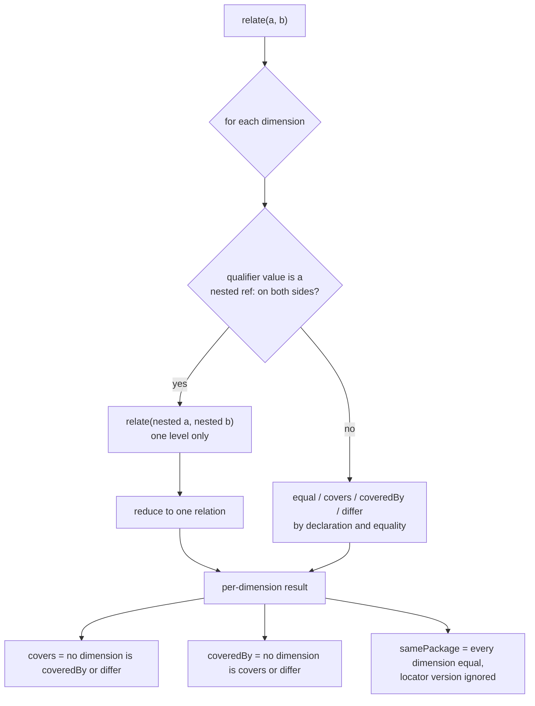

<!--
 Copyright (c) 2026 Danilo Borges (https://github.com/daniloborges)

 Licensed under the Apache License, Version 2.0 (the "License");
 you may not use this file except in compliance with the License.
 You may obtain a copy of the License at

 https://www.apache.org/licenses/LICENSE-2.0
-->

# Plan-005: The comparison descends into nested identifiers

| Field | Value |
|---|---|
| Status | Backlog |
| Created | 2026-09-23 |
| Author | Danilo Borges |
| Related | ADR-0005 (the `ai-model` locator opens on the provider) |

---

## Summary

`covers` and `samePackage` compare a qualifier by byte equality, even when its value is a nested `ref:`
identifier that the same operation could compare. So `…;by=ref:pkg:github/ggml-org/llama.cpp` does not
cover `…;by=ref:pkg:github/ggml-org/llama.cpp@b10931`, although the two nested identifiers stand in exactly
that relation when compared directly. **This is a bonus, not a gap in the pointer.** An identifier is the
locator and the declared name; `by=` is enrichment on top of it, and a nested identifier is a bare pointer
(`docs/reference/the-ref-scheme.md`, "What an identifier carries"). A query that has to reach an
attribute — which engine build, whether it was recorded — runs on the consumer's columns. What this plan
buys is that the comparison stops being stricter than the scheme it compares, for consumers that do key a
mixed-kind store by identifier. This plan makes both operations descend into a nested identifier,
and adds `relate`, an operation that reports the relation in every dimension instead of reducing it to one
boolean. The specification and its vectors change first. The three implementations follow in one
realignment pass, because their code has already drifted apart on other points and is being brought back
in line at once.

## Goals

- `covers(a, b)` is `true` when every qualifier `a` declares is declared by `b` with a value that `a`'s
  value covers. A nested identifier is compared with `covers`, and any other value by equality.
- `samePackage` descends the same way, with `samePackage` on the nested pair.
- A new `relate(a, b)` reports, for each dimension the specification lists in `comparison.dimensions`,
  whether `a` and `b` are `equal`, whether one covers the other, or whether they `differ`. `covers`,
  `coveredBy` and `samePackage` are stated as reductions of that result.
- A vector group binds every rule above, so an implementation that disagrees fails its own suite and the
  differential.
- `main` never holds a specification that one of its implementations cannot run.
- The specification declares the public surface — each operation's name, parameters, result and the
  vector group that binds it — and each implementation's suite fails when its surface departs from that
  declaration, in either direction. The three implementations expose the same operations under the same
  names, spelled by each language's convention.

## Scope

### In scope

- The `comparison` block of `spec/ref-id.json`: the `covers` and `samePackage` rules, and a new `relate`
  entry.
- Vectors: the existing `comparison` group, and a new `relate` group.
- The TypeScript reference, the Rust crate and the Swift port, including their runners' lists of executed
  groups and the differential in `scripts/differential.mjs`.
- `docs/reference/the-ref-scheme.md` and a changeset.
- A new `openRPC` key in `spec/ref-id.json` holding one OpenRPC document, and one surface check per
  implementation that reads it.

### Out of scope

- "The same weights through any provider" (`omlx/<repo>` against `mlx/<repo>`). Different first locator
  segments make those two different models by ADR-0005's own rule. A consumer that needs the weights
  compares their `pkg:huggingface` identity instead.
- Nesting deeper than one level. The specification already refuses it at parse time (the vector *"nesting
  deeper than one level is malformed"*), so the recursion is bounded at one step.
- "Version unknown" as part of an identifier. A nested identifier is a bare pointer, so an engine build
  nobody recorded is a column of the consumer's record, never `%3Bstate=none` inside `by=`. The grammar
  still parses that form, and the descent compares whatever a nested identifier carries, but no vector
  and no example here writes one.

## Design

A comparison already splits into the dimensions `comparison.dimensions` names: type, version, locator
stem, locator version, fragment path, fragment refinements, and qualifiers. `relate` computes one relation
per dimension, and for each qualifier key, in a closed set of four values:

| Relation | Meaning for a dimension |
|---|---|
| `equal` | both sides declare it identically, or neither declares it |
| `covers` | `a` is the general side: it leaves the dimension undeclared where `b` declares it, or its stem is a whole-segment prefix of `b`'s, or its nested identifier covers `b`'s |
| `coveredBy` | the mirror of `covers` |
| `differ` | both declare it, and neither side reaches the other |

A qualifier whose value on both sides is a nested `ref:` carries the nested pair's own `relate` result
under `nested`. Its relation is that result reduced by the same rule as the top level. A `sha256:` value,
a timestamp or plain text is `equal` or `differ`.



Three consequences are part of the design, not side effects:

- Results change. A pair `covers` reports `false` for today, like the `by=` vector ADR-0005 added, becomes
  `true`. The change touches no normalisation and no separator, so by this repository's own rule it is an
  addition and ships as `minor`. The changeset still states that a stored comparison result may flip.
- `samePackage` on `by=…@1` and `by=…@2` becomes `true`: the same engine at two releases. That matches
  what `samePackage` already does to a locator version.
- `relate` is the first operation whose output shape the specification declares. The vector group is the
  declaration, and every implementation's runner must list it, or refuse to start.

**Ordering constraint.** The Rust and Swift runners declare the groups they execute
(`crates/ref-id/tests/conformance.rs`, `Sources/RefIdConformance/main.swift`) and refuse any group the
specification declares beyond them. A changed `comparison` vector also fails every implementation until
that implementation changes. So Tracks 1, 3 and 4 land on this plan's branch and **merge together with
Track 2**, never before it.

**One branch, one pull request.** Every track commits onto the branch `plan-comparison-descends-into-nested`,
which already carries this plan, and pull request #21 is the single vehicle for all of it. Do not open a
second branch or pull request for a track: #21 merges once, after Track 2, when every command in Success
criteria exits `0`.

## Tracks

- [x] **Track 1 — The rule descends.** Rewrite `comparison.covers.rule` and `comparison.samePackage.rule`
  in `spec/ref-id.json` so that a qualifier whose value is a nested identifier on both sides is compared
  with the same operation. Flip the vector *"a declared by= must match exactly — an unversioned engine does
  not cover a versioned one yet"* to `covers: true`, and add vectors for a versioned `by=` not covering
  an unversioned one, for two different engines staying `false`, for `samePackage` across two engine
  releases, and for `sha256:` values staying strict. Every nested identifier in the new vectors is a bare
  pointer. Reseal, sync the two embedded copies, regenerate the browser
  constant. Acceptance: the grammar runners pass, and each implementation fails on exactly the flipped and
  new vectors.
- [x] **Track 3 — `relate` is declared.** Add a `comparison.relate` entry with the four relations and the
  reduction rules, and a `relate` vector group of pairs with their full expected result. The pairs cover
  one pair per dimension, a nested `by=` in each of the four relations, and the three reductions checked
  against the `comparison` group on the same pairs. Document it in `docs/reference/the-ref-scheme.md`.
  Acceptance: every `relate` vector's reductions agree with the `comparison` group's expectations for the
  same pair, checked by a script, not by eye.
- [x] **Track 4 — The surface is declared.** Add an `openRPC` key to `spec/ref-id.json` whose value is one
  whole OpenRPC document: a method per public operation with its camelCase name, parameters in order,
  result and errors; the value types (`ParseResult`, `BuildParts`, `EnvelopeResult`, …) under
  `components.schemas`; `x-casing` per language. Each method carries `x-vectors`, the group that binds
  it (or `null` with the reason), and `x-rule`, a JSON Pointer into `ref-id.json` naming the key that
  states its rule (`/comparison/covers`). A `$ref` resolves against the OpenRPC document, an `x-rule`
  against the whole specification, and a check resolves both and validates the extracted value against
  the OpenRPC meta-schema. `relate` from Track 3 and
  `sameIdentifier` are declared; `canonical` is declared as `canonicalIdentifier`, and the JSON
  canonicalisation as `canonicalise`. An identifier parameter accepts a string or a `ParseResult`, mixed
  freely, in all three. Each implementation's own suite gains a surface check that reads its surface
  from the compiler, never from a regular expression over the source, and fails on a missing or extra
  operation and on a changed name, arity or type:
  - **Swift** — the conformance runner reads `swift package dump-symbol-graph`, which lists every public
    symbol with its full declaration, argument labels and `throws`, and compares it with the methods.
  - **Rust** — a test generated from the methods holds each one as a typed function pointer
    (`const _: fn(&str, &str) -> bool = ref_id::covers;`), so a missing function or a moved signature
    fails compilation. An extra public name is found by reading the `pub use` lines of `lib.rs` with
    `tree-sitter-rust` through `web-tree-sitter`, both WebAssembly, so nothing builds natively. rustdoc
    JSON is not used: stable Rust emits it only under `RUSTC_BOOTSTRAP=1`, and its format changes between
    releases.
  - **TypeScript** — a test imports each entry point in a child process and compares its runtime
    exports with the methods, and a type file generated from the methods is checked by `tsc`.
  Every generated test file has a staleness guard that regenerates it and diffs the committed copy, the
  way `spec.browser.ts` is guarded. The checks run inside `npm test`, `cargo test` and
  `swift run ref-id-conformance`, so the existing CI jobs run them; one cross-language table,
  `npm run test:surface`, joins the macOS job that already has the three toolchains. Nothing is added to
  `.vibe-ops/`. The two TypeScript tests that import `covers`, `samePackage`, `canonical` and
  `sameIdentifier` from internal modules import them from the entry point instead. Acceptance: the
  `openRPC` value validates against the OpenRPC meta-schema, every `x-rule` and `$ref` resolves, and each
  surface check fails today on exactly the divergences the survey found.
- [x] **Track 2 — The three implementations follow.** In one realignment pass over TypeScript, Rust and
  Swift, bring the drifted code back into agreement, implement the descent and `relate`, add `relate` to
  each runner's executed groups and to `scripts/differential.mjs`, and write the changeset. The surface
  checks Track 4 left failing are the list, per implementation:
  - **TypeScript** — rename `canonical` to `canonicalIdentifier`, keeping `canonical` as a deprecated
    alias; add `relate`; export the types `Fragment` (today `ParsedFragment`), `Spec` (today `RefIdSpec`),
    `RelateResult`, `Relation`, `QualifierRelation`, `IdentifierOrParsed`; make `canonicalise` throw a
    `SpecIntegrityError` rather than a plain `Error`.
  - **Rust** — add `same_identifier` and `relate` with a `RelateResult` type; accept `&ParseResult`
    wherever an identifier is taken (`canonical_identifier`, `same_identifier`, `same_package`, `covers`,
    `relate`), through a trait, so every call written with `&str` still compiles.
  - **Swift** — add `sameIdentifier`, `relate` with a `RelateResult` type, `canonicalise(_:)` taking
    `Any?` (today `canonicalJSON(_:)` taking `Any`, kept as a deprecated alias), and
    `loadSpecFrom(_:)` taking a `URL` (today `loadSpec(from:)`, kept as a deprecated alias); accept
    `ParseResult` wherever an identifier is taken.
  A deprecated alias is declared in `openRPC` as it is added, so the surface checks accept it by
  declaration rather than by exception. Acceptance: every suite passes, `npm run test:surface` reports no
  divergence, and the differential reports zero disagreements. Then the branch merges.
- [x] **Track 5 — The differential compares pairs.** The four implementations agree on every parse and
  still disagreed on comparisons no vector names: an adversarial review built 3025 pairs and found
  `sameIdentifier` and Unicode handling diverging with every suite green. `scripts/differential.mjs`
  gains a second pass over every ordered pair of its corpus. Each port gains a `--pairs` mode on the same
  line protocol: stdin carries two lines per pair, `a` then `b`, escaped as `--parse` escapes them; stdout
  carries one line per pair, the canonical JSON (`canonicalise`) of
  `{covers, coversReversed, samePackage, sameIdentifier, relate}`, where `coversReversed` is
  `covers(b, a)` and `relate` is the full result or `null`. Two lines per pair rather than a separator,
  because the grammar admits a tab in a locator. The differential compares every field of every pair
  against the reference row and fails on the first disagreement. Acceptance: zero disagreements, and the
  pass shown to fail on a planted divergence.
- [x] Run `/vibe-ops:close-plan` — retrospective against the goals, the demotion check, the tracking
  issue closed. The plan file itself is kept. Stays unchecked until the plan is actually closed; a
  track list that is otherwise complete but has this box open is not finished.

## Success criteria

```sh
npm run typecheck              # TypeScript surface, by signature
npm test                       # TypeScript reference, every vector group including relate
npm run test:grammar           # Python and Perl grammar runners
npm run test:relate            # relate vectors agree with comparison vectors, from the spec alone
npm run test:openrpc           # the declared surface is valid OpenRPC and tied to rules and vectors
cargo test --workspace         # Rust crate, surface bindings included
swift run ref-id-conformance   # Swift port, surface references included
npm run test:surface           # no undeclared public function; every alias present
npm run test:differential      # four implementations, every input and every pair, zero disagreements
./scripts/check.sh             # governance gate
```

All exit `0` on the branch before it merges. Then this pair:

```text
a = ref:ai-model:example-app;by=ref:pkg:github/ggml-org/llama.cpp
b = ref:ai-model:example-app/bartowski/SmolLM2-1.7B-Instruct-GGUF/SmolLM2-1.7B-Instruct-Q4_K_M.gguf;by=ref:pkg:github/ggml-org/llama.cpp@b10931
```

gives `covers(a, b) = true` in all three implementations — it is a `comparison` vector each suite runs —
and the pair pass of the differential holds the four builds to one answer on it. The same `b` against `…;by=ref:pkg:swift/github.com/ml-explore/mlx-swift-lm@3.31.4` gives
`false`: a different engine.

---

## Decision Log

- Decision: Tracks run in the order 1, 3, 2. The specification and vectors for both the descent and
  `relate` are written first, and the implementations follow in a single pass.
  Rationale: the three implementations have already drifted from one another and need a realignment pass
  regardless. Implementing the descent before that pass would mean writing it three times against code
  that is about to move.
  Date / Author: 2026-09-23 / Danilo Borges
- Decision: Tracks 1 and 3 are not handed to a subagent: whoever writes them holds this plan. Track 2 is
  carried out by the session doing the realignment pass, behind the six commands in Success criteria, and
  may delegate each implementation.
  Rationale: the rule text and the vectors are judgements that have to agree with this plan's intent. The
  implementation is mechanical against a closed contract — the vectors — and a gate that fails on the
  first disagreement.
  Date / Author: 2026-09-23 / Danilo Borges
- Decision: All three tracks commit onto `plan-comparison-descends-into-nested` and ship through pull
  request #21, which is opened with the plan and stays open until Track 2 is green.
  Rationale: the specification tracks cannot merge alone, since the runners would refuse them, so a
  pull request per track would have to wait for the last one anyway. Reusing #21 keeps the plan, its vectors and
  their implementation reviewable as the one change they are.
  Date / Author: 2026-09-23 / Danilo Borges
- Decision: `covers` with descent is the requirement, and `relate` follows it. If only one can ship, it is
  the descent.
  Rationale: the consumer that searches stored replies needs a boolean on its hot path. The consumer that
  types graph edges by relation needs `relate`, and it is not built yet.
  Date / Author: 2026-09-23 / Danilo Borges
- Decision: The descent and `relate` are a bonus on the comparison, not a requirement of any consumer.
  `by=` is enrichment on a pointer that already works without it, a nested identifier is a bare pointer,
  and "version unknown" is a column; the `state=none` vectors and the success-criteria pair that used one
  are dropped. The ordering between the descent and `relate` in the entry above still holds.
  Rationale: the scheme now says an identifier is a reference, not a copy of the record (reference, "What
  an identifier carries"). The consumer this plan named searches stored replies by engine and build on its
  own columns, so its hot path never reaches a nested comparison. Whether a nested qualifier becomes
  `malformed` is left to how that guidance holds up in use.
  Date / Author: 2026-09-23 / Danilo Borges
- Decision: The descent applies to any qualifier whose value is a nested `ref:` on both sides, not to `by=`
  alone; a vector on `over=` binds it. A nested pair the relation refuses — a scheme version the
  implementation does not support — falls back to byte equality, and so does a nested identifier facing a
  digest.
  Rationale: the grammar gives `by=` and `over=` the same nested form, and a rule naming one key would be
  a second table of keys in prose. A refused pair has no parts to compare, and equality is what the rule
  said before, so it is the only answer that cannot be wrong for it.
  Date / Author: 2026-09-23 / Danilo Borges
- Decision: The success-criteria pair and its vector use `pkg:github/ggml-org/llama.cpp`, not
  `pkg:swift/…/mlx-swift-lm`. The vector "a versioned `by=` not covering an unversioned one" was not
  added: it is the `coversReversed` of the flipped vector.
  Rationale: the Package URL specification requires a version on the `swift` type, and `packageurl-js`
  refuses `pkg:swift/github.com/ml-explore/mlx-swift-lm` ("swift requires a "version" component"), so the
  pair this plan first wrote parsed `malformed` at `by`. A Swift engine is therefore never an unversioned
  query; "every release of it" is `samePackage` on it, which ignores the version.
  Date / Author: 2026-09-23 / Danilo Borges
- Decision: Track 1 is accepted on this evidence: the grammar runners pass (128/128 each); TypeScript and
  Swift fail on exactly the five vectors whose answer depends on the descent, and pass the four that stay
  strict; Rust fails at the first of those five, because its comparison test stops at its first assertion.
  Rationale: the Rust harness cannot list the rest until the first passes, so its full list is Track 2's
  first reading rather than this track's.
  Date / Author: 2026-09-23 / Danilo Borges
- Decision: Track 4 declares the public surface in the specification, and the tracks now run 1, 3, 4, 2.
  The declaration completes Rust and Swift up to TypeScript rather than trimming TypeScript down:
  `sameIdentifier` is added to both, and both accept a `ParseResult` wherever an identifier is taken — a
  trait in Rust, a protocol or overloads in Swift, so every call written with a string still compiles.
  Renames that change a published name (`canonical` → `canonicalIdentifier` in TypeScript,
  `canonicalJSON` → `canonicalise` in Swift) keep the old name as a deprecated alias for one minor.
  Rationale: a survey of the three surfaces found `covers` already agrees everywhere, and seven real
  divergences elsewhere — two names, one operation present only in TypeScript, identifier parameters that
  accept a parse result only in TypeScript, an error class outside the package's own hierarchy, a type
  name, and three spellings of loading a specification. Nothing detects any of them: the specification
  declares no surface, and the TypeScript tests for `canonical` and `comparison` import from internal
  modules, so an operation dropped from the entry point leaves its vectors green. Declaring before Track 2
  lets the realignment pass implement against the declaration once instead of twice.
  Date / Author: 2026-09-23 / Danilo Borges
- Decision: The surface is declared as one OpenRPC document under the key `openRPC` of `ref-id.json`, with
  each method pointing at the key that states its rule through `x-rule`. A separate `api` block, an
  `operation` field inside each rule key, and OpenRPC as a second file in `spec/` were each considered.
  Rationale: ADR-0001 ships the specification as one file, which rules out a second file. Fields spread
  across rule keys would not form a document, so no OpenRPC tool could read them and every `$ref` would
  need to know which key it landed in. One embedded document is still a valid OpenRPC document once
  extracted, keeps the surface in one list, and `x-rule` keeps the rule where it already lives. A
  research worktree reached the same five name divergences independently with an OpenRPC file and a
  name check; its ABNF grammar and grammar derivation are a separate question and stay out of this plan.
  Date / Author: 2026-09-24 / Danilo Borges
- Decision: A surface is read from each language's compiler, with `tree-sitter-rust` only for Rust's
  extra public names, and the checks live in each implementation's suite and in CI, not in `.vibe-ops/`.
  Rationale: a regular expression and a syntax tree both read spelling, not meaning — neither follows a
  `pub use` to the signature it re-exports, nor resolves a Swift overload. Measured on this machine:
  `swift package dump-symbol-graph` on the stable toolchain returned all thirteen public functions with
  labels and `throws`, including the extras; stable `rustdoc --output-format json` is refused without
  `-Z unstable-options`; `tree-sitter-swift` 0.7.1 ships no WebAssembly build and would compile natively,
  while `tree-sitter-rust` 0.24.0 ships one. `.vibe-ops/` runs at every commit and builds nothing, and a
  surface check needs two compilers, so it belongs where the vector-group check already lives.
  Date / Author: 2026-09-24 / Danilo Borges
- Decision: `relate` always reports the five fixed dimensions, and a keyed dimension — refinements,
  qualifiers — only the keys at least one side declares; a dimension neither side declares is `equal`.
  Every dimension is computed on its own, so two different types still report their locators. A pair
  `covers` refuses relates to `null`. Every qualifier member is an object with `relation`, and carries
  `nested` only where both values are nested identifiers the operation accepts.
  Rationale: the fixed dimensions are finite, so reporting them keeps one output shape; the keyed ones are
  open-ended, so only the declared keys can be reported at all. A uniform qualifier member keeps the Rust
  and Swift result types free of a string-or-object union. Computing dimensions independently keeps the
  rule free of a short-circuit order every implementation would have to reproduce; the `type` dimension
  alone already stops the pair from covering.
  Date / Author: 2026-09-24 / Danilo Borges
- Decision: Track 3 is accepted on `scripts/check-relate.mjs` (`npm run test:relate`, run in CI before the
  suites): the 19 `relate` vectors reduce to their stated booleans, the 11 pairs the two groups share agree,
  and every nested result reduces to its qualifier's relation. The script was shown to fail by altering one
  expected relation. The expected results were produced by a scratch generator written from the rule text,
  whose reductions first matched all 37 `comparison` vectors, and each was then read against the rule.
  Rationale: the script reads the specification alone, so a disagreement between the two groups is caught
  as a defect of the data rather than as three ports each failing one group.
  Date / Author: 2026-09-24 / Danilo Borges
- Decision: Track 4 is accepted with the declaration carrying every fact a generator needs, so each
  generator reads the specification alone. The first round had the Swift generator scan the library's
  source with a regular expression and the Rust one key an exception on a method name, because the
  declaration left four things out; each became a declared field instead: `x-error-type` with the five
  error kinds the three implementations already share (the first draft had three, one a catch-all);
  `components.schemas.Spec` with `x-result-cached`; `x-argument-labels`; and `x-kind: "directory"` on a
  string that is a filesystem path. The surface checks fail today on the list Track 2 now carries, and on
  nothing else; each was shown to fail on a planted rename or extra export.
  Rationale: a generator that consults the code it checks can only confirm the code. The Swift half of
  `check-surface.mjs` builds the `RefId` target alone with `-emit-symbol-graph`, because
  `swift package dump-symbol-graph` builds every target and the conformance runner is the target that
  fails to build while a method is missing. Until Track 2, `cargo test --workspace` and
  `swift run ref-id-conformance` stop at compilation, by design. The TypeScript `typecheck` script now
  checks `src` and the generated file only: three older test files have never been type-checked and carry
  type errors, which a wider scope would have to fix first.
  Date / Author: 2026-09-24 / Danilo Borges
- Decision: Identity is presence, not spelling. Refinement order does not distinguish (each refinement,
  like each qualifier, is a filter, and filters combine with AND); a nested identifier is written in its
  own canonical form; the default version written or omitted is one identifier (`ref:1:x` is `ref:x`).
  The canonical form now does all three, and the vectors that pinned the opposite were rewritten.
  Rationale: with every suite green, `relate` and `covers` treated refinements as keyed while
  `sameIdentifier` treated their order as significant, so a pair could relate as `equal` in every dimension
  and still be two identifiers. The earlier reasoning — refinements are positional because `lines=1,20` is
  a range — confused the order inside one value, which is content, with the order between keys, which is
  not. The reference already called `ref:1:` spelling rather than a different identifier class.
  Date / Author: 2026-09-24 / Danilo Borges
- Decision: A fifth track, a pair pass in the differential, lands before the merge rather than as later
  work, and comparison is byte for byte in every implementation.
  Rationale: an adversarial review built 3025 pairs and found two disagreements no vector named —
  `sameIdentifier` true in Rust and Swift for an identifier at an unsupported version, and Swift comparing
  text by Unicode canonical equivalence where TypeScript and Rust compare bytes. Both were invisible to
  every suite and to a parse-only differential. The pair pass runs 38416 pairs through four builds in
  about twenty seconds, and was shown to fail on one planted field. The same review found a Rust API break
  (`&String` arguments no longer compiled), a TypeScript signature check no CI ran, deprecated aliases no
  check required, and Rust public items the surface reading could not enumerate; each is fixed and bound.
  Date / Author: 2026-09-24 / Danilo Borges

## Outcomes & Retrospective

Against the goals, one by one:

- **`covers` descends into a nested identifier — met.** A nested `ref:` on both sides is compared with
  `covers` on the decoded pair; a digest, a timestamp, text, a nested identifier facing a digest and a
  nested pair at a refused scheme version stay byte for byte. Bound by nine `comparison` vectors.
- **`samePackage` descends the same way — met**, on the same vectors.
- **`relate` with `covers`, `coveredBy` and `samePackage` as its reductions — met.** 19 `relate` vectors;
  `npm run test:relate` checks from the specification alone that their booleans follow from their results
  and agree with the `comparison` group on the 11 pairs both hold. Rust computes `covers` and
  `samePackage` as reductions of `relate`; TypeScript and Swift compute them directly, and the differential
  holds the two approaches to one answer.
- **A vector group binds every rule — met, and the goal was too narrow.** Every rule is bound, and every
  suite passed — while the three implementations disagreed on two answers no vector named
  (`sameIdentifier` on an unsupported scheme version; Swift comparing Unicode text by canonical
  equivalence). An adversarial review found them by building 3025 pairs. The goal as written was satisfied
  and insufficient; Track 5 (the differential's pair pass) is what closed the gap, and binding the last
  unvectored Swift sites then surfaced a third divergence, in the canonical purl subpath.
- **`main` never holds a specification an implementation cannot run — met.** All tracks landed on one
  branch and merge together through #21.
- **The public surface is declared and held, in both directions — met.** `openRPC` declares 13 methods
  and 14 value types; each suite reads its surface from its compiler and `npm run test:surface` finds
  undeclared public functions and missing aliases. Names now differ only by casing.

**The success criteria** were run in full on the final branch: `tsc` clean, TypeScript 279/279, the
grammar runners 129/129, `test:relate` and `test:openrpc` clean, Rust 15/15, Swift 937/937,
`test:surface` with nothing missing, undeclared or unreadable, the differential at 197 inputs and 38809
pairs × 4 implementations with no disagreement, and the governance gate at 58 checks, 0 failed. The first
version of the criteria **overclaimed**: it said a `comparison` vector made the differential prove a pair,
when the differential compared parse output only. The criterion was wrong in the optimistic direction, and
Track 5 made it true.

**Beyond the plan.** The scope grew in three places, each recorded in the Decision Log: Track 4 (the
declared surface) was added mid-plan; identity became presence rather than spelling (refinement order, a
nested identifier's own canonical form, the default version); and Track 5 was pulled before the merge
instead of left as follow-up work. The nested-identifier guidance (`docs/reference`, "What an identifier
carries") and ADR-0005's correction to it landed on the same branch.

**Still open, inherited by later work:** the `unknown` locator's character limits and a `BuildError`
message that omits the part (#16, item 2 — items 1 and 3 are now in the `identify` skill's Step 1 and the
reference); the type-level names the surface checks do not
compare across languages (`NestedQualifierValue` in TypeScript against `QualifierValue`); three older
TypeScript test files that have never been type-checked; and whether the nested-identifier guidance
becomes a grammar rule, decided on how the guidance holds up in use.

---

## Open questions

*None open.*

## Related

- ADR-0005 — the `ai-model` locator opens on the provider; records the `by=` behaviour this plan changes.
- `comparison` block of `spec/ref-id.json` — the rules and `dimensions` this plan extends.

- Task dossiers closed and removed per the task lifecycle (`Planned → In Progress → Done → file removed, git history is the archive`):
  - `git show 255ea4d064b2b3767d7f00e215bb4a96b5322699:project/tasks/023-typescript-surface-and-descent.md`
  - `git show 255ea4d064b2b3767d7f00e215bb4a96b5322699:project/tasks/024-rust-surface-and-descent.md`
  - `git show 255ea4d064b2b3767d7f00e215bb4a96b5322699:project/tasks/025-swift-surface-and-descent.md`
