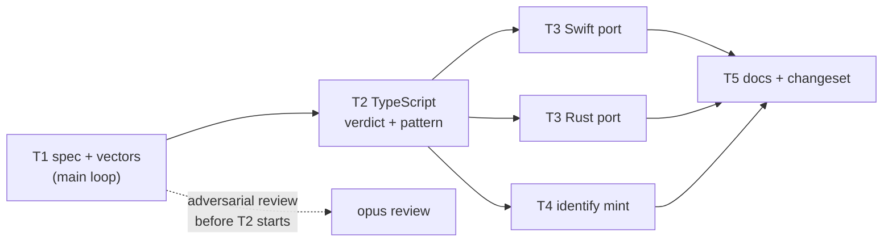

<!--
 Copyright (c) 2026 Danilo Borges (https://github.com/daniloborges)

 Licensed under the Apache License, Version 2.0 (the "License");
 you may not use this file except in compliance with the License.
 You may obtain a copy of the License at

 https://www.apache.org/licenses/LICENSE-2.0
-->

# Plan-006: Location hints and the verdict

| Field | Value |
|---|---|
| Status | In Progress |
| Created | 2026-09-26 |
| Author | Danilo Borges |
| Related | ADR-0006 (location enters the identifier as a hint, never as identity) |

---

## Summary

The `folder` type is the shallowest part of the scheme. Its specification promises a declaration mechanism
that does not exist, the `identify` skill fills the gap by taking a directory's base name, and the result
collides inside this repository, changes from one worktree to the next, and admits a locator that climbs
out of itself with `..`. ADR-0006 settles the design: location enters the identifier as a hint with a role
of its own, a `folder` name is a claim of whoever writes it, and a new `verdict(a, b)` decides — on an
identity axis and a content axis — what two identifiers carrying different hints mean together. This plan
carries that decision into the specification, the three ports and the minting tool.

## Goals

1. `spec/ref-id.json` declares a `location` role and three qualifiers in it — `path=`, `origin=`,
   `corpus=` — with their forms, the five `path=` template tokens, and the conflict each decides; the
   sentence about a repository configuration is gone.
2. A `folder` locator, and a `path=` value, with a `.` or `..` segment is `malformed` in every port.
3. `verdict(a, b)` exists in TypeScript, Swift and Rust, returns the two axes and `decidedBy`, and all three
   agree on every `verdict` vector.
4. `identify`'s `mint` measures a path from the repository's top level, records the hints it used, reports
   a claimed name as claimed, and emits a public and a private variant whenever `origin=` is not
   anonymously readable.
5. The reference, the explanation and the `identify` skill describe the present: no page says a `folder`
   corpus is declared in a repository configuration, and the rejected-alternatives entry points at
   ADR-0006.

## Scope

### In scope

The specification blocks `qualifiers`, `roles`, `dispatch.folder`, `comparison` and their vectors; the
`verdict` operation and its OpenRPC entry; the `folder` pattern in the three ports; `identify.ts mint`;
`docs/reference/the-ref-scheme.md`, `docs/explanation/why-a-declared-name.md`,
`.agents/skills/identify/SKILL.md`; a changeset.

### Out of scope

Resolving an identifier to bytes. `verdict` compares strings; following `path=` or `origin=` to a file is
a reader's work and stays outside the package, as it is today for a Package URL and its registry.

`publishedAs` in `identify.ts` consults npm only, so a file the crate ships is minted as `folder` rather
than as `pkg:cargo/…`. That defect is real and unrelated to location; it gets its own task.

Location qualifiers on types other than `folder`. The role is declared for every type, because the
comparison is generic, but only `folder` is changed and exercised here.

## Design

**The specification, first and alone.** ADR-0001 makes `spec/ref-id.json` the one source every port
consumes, so nothing else starts until it lands. Four blocks change:

- `qualifiers` gains `path`, `origin` and `corpus`, each with `"role": "location"`, its forms, and an
  `onConflict` member naming what a differing value decides (`distinct` or `undetermined`), plus the
  `path=` exception — `distinct` only when neither side carries `origin=` or `state=`.
- `roles` gains `location` as a list of those keys, and `roles.note` is rewritten to the ADR's rule:
  location is a hint that narrows where to search and never decides by itself what is named.
- `dispatch.folder.pattern` refuses a segment that is exactly `.` or `..` — not every segment opening on
  `.`, as the `url` entry does, because `.github/` and `.agents/` are ordinary folders a file lives under;
  `declaredBy` is replaced by a sentence stating the name is claimed by the writer and a declaration, when
  one exists, is reached through `corpus=`.
- `comparison` gains `verdict` beside `samePackage`, `covers` and `relate`, stated as a reading of
  `relate`'s result: the rules in the table below, the two axes, and `decidedBy`.

| Dimension or key | Both present, equal | One side only | Both present, different |
|---|---|---|---|
| type / locator / fragment path | as `relate` | as `relate` | identity `distinct` |
| `origin=` | agrees | as `relate`: the side without it covers | identity `distinct` |
| `path=` | agrees | as `relate`: the side without it covers | `undetermined`; `distinct` when neither side has `origin=` or `state=` |
| `corpus=` | agrees | as `relate`: the side without it covers | identity `undetermined` |
| `state=` | content `same` | content `unknown` | content `different` |
| any other qualifier or refinement | as `relate` | as `relate` | identity `distinct` |

A key on one side only follows `relate` because the scheme already reads a partial identifier as a query:
the side that leaves a hint undeclared is the general one and reaches the side that declares it. So
`verdict` never contradicts `covers` for the same pair, and `undetermined` is reserved for two hints that
disagree without being able to separate what they name.

`path=` values are validated by one pattern: an optional leading token from the closed set
`~`, `{tmp}`, `{config}`, `{data}`, `{cache}`, then `/`-separated segments, no `.` or `..` segment, no
trailing separator; or an absolute path outside every token, with a lowercase drive letter where there is
one. `origin=` is an `https` URL in one spelling only — lowercase ASCII path, no port, no userinfo, no dot
segment, no `.git` — because an `origin=` conflict decides `distinct` and a second spelling would separate
one repository from itself. `corpus=` is either a relative path under the same
segment rule or a nested `ref:` under the existing one-level nesting encoding.

**A package manifest is a declaration `corpus=` can name.** The `pkg` entry already treats the nearest
manifest declaring a name as a corpus, and says a file in an *unversioned* corpus is named through
`folder` because a Package URL has no marker between name and path without a version. That case is
implicit today; this plan makes it explicit: `ref:folder:<name>/<path>;corpus=<dir>/package.json` names a
file under a manifest whose `name` is `<name>`, and the specification lists the manifests it recognises
(`package.json`, `Cargo.toml`) as declaration forms. **The path in the locator is measured from the
directory of whichever source gave the name** — the manifest's directory, or the repository's top level —
never from another, which is the invariant that keeps
two files of one name in two packages apart. A manifest whose name the `folder` pattern refuses — a scoped
npm name such as `@acme/tools` — is not a usable declaration and is reported as skipped, so the next source
in the order supplies the name.



**The ports follow the TypeScript reference.** `packages/ref-id/src/relations.ts` already computes
`relate`; `verdict` is a reduction over its result and belongs in the same module, exported from
`packages/ref-id/src/index.ts` and `index.browser.ts`. The Swift port lives in `Sources/RefId`, the Rust
port in `crates/ref-id/src`; each consumes the same vectors through its own conformance runner, and the
spec mirrors in `Sources/RefId/Resources/` and `crates/ref-id/spec/` are refreshed with
`node scripts/seal-spec.mjs` before either runs.

**The minting tool.** `.agents/skills/identify/scripts/identify.ts` changes in four places. `folderCorpus`
measures the path from the directory of the source that gave the name. The name comes, in order, from
`--locator`; inside a git repository, from the repository name in the `origin` remote, or the top-level
directory's base name when there is no remote, with the path measured from `git rev-parse
--show-toplevel`; and only outside any git repository, or when asked for explicitly, from the nearest
recognised manifest whose name fits the pattern, recorded as `corpus=`. Every source but `--locator` is
reported as `"nameSource": "claimed"`. `origin=` is recorded whenever a remote exists,
rewritten from SSH to `https` and stripped of credentials. Visibility is measured by one anonymous
`git ls-remote` with credentials and prompts disabled: exit `0` is `public`, anything else is `private`,
and `--offline` makes it `unknown` without the network. When visibility is not `public`, the output
carries `variants.private` (with `origin=` and any `path=`) and `variants.public` (without either) and a
`warning` naming why; `path=` is written only with `--path-hint` or when there is no remote.

## Tracks

- [x] **Track 1 — The specification and its vectors.** Edit `spec/ref-id.json` by text substitution — it
      is hand-formatted, and a JSON round trip rewrites bytes nobody touched — then
      `node scripts/seal-spec.mjs`, the two mirrors, and `node scripts/gen-spec.mjs` for the browser
      constant. Vectors cover each `path=` token, each refusal (`..`, trailing `/`, relative path,
      userinfo in `origin=`, a repeated location key), the `folder` traversal refusal, `corpus=` naming a
      manifest and a nested `ref:`, and every row of
      the verdict table including the three readings of `state=`. `specVersion` moves to `1.5.0`. An
      `opus` adversarial review of the spec diff runs before Track 2 starts. The acceptance is the review
      returning no blocker and the grammar checks in `spec/conformance/` still passing.
- [x] **Track 2 — `verdict` and the `folder` pattern in TypeScript.** `verdict` in `relations.ts`, its
      exports, and the conformance runner reading the new vectors. The acceptance is `npm test` green in
      `packages/ref-id` with every new vector exercised. Task: tasks/028-verdict-in-the-typescript-reference.md
- [ ] **Track 3 — The Swift and Rust ports.** The same operation and pattern in `Sources/RefId` and
      `crates/ref-id`, each behind its own runner. The acceptance is `swift run ref-id-conformance`
      passing every vector and `cargo test` green, with the differential against the TypeScript reference
      showing no new disagreement. Task: tasks/029-verdict-in-the-swift-and-rust-ports.md
- [ ] **Track 4 — `mint` records hints and variants.** The four changes to `identify.ts` described in
      Design. The acceptance is the three measurements that motivated ADR-0006 coming out differently:
      the root `README.md` and `crates/ref-id/README.md` mint different identifiers; the same file minted
      from the main checkout and from a worktree relates as identity `same`; and no minted locator
      contains a `..` segment. Task: tasks/030-identify-mint-records-location-hints.md
- [ ] **Track 5 — The prose describes the present.** `docs/reference/the-ref-scheme.md` (the delegation
      table's `folder` row, the corpus paragraphs, a new section on location qualifiers and `verdict`),
      `docs/explanation/why-a-declared-name.md` (the rejected-alternatives entry points at ADR-0006 and
      says what was answered), `.agents/skills/identify/SKILL.md` (the base-name paragraph, the refusal
      row's stale pattern, and the expiring paragraph about the missing declaration mechanism, which this
      plan makes wrong), and a changeset for a minor release.
- [ ] Run `/vibe-ops:close-plan` — retrospective against the goals, the demotion check. The plan file
      itself is kept. Stays unchecked until the plan is actually closed; a track list that is otherwise
      complete but has this box open is not finished.

## Success criteria

```sh
node -e 'import("./packages/ref-id/dist/index.js").then(m => console.log(m.parse("ref:folder:a/../../etc/passwd").status))'
# → malformed

node .agents/skills/identify/scripts/identify.ts mint --path README.md --fragment x
node .agents/skills/identify/scripts/identify.ts mint --path crates/ref-id/README.md --fragment x
# → two different "ref" values, each carrying origin=, nameSource "claimed"

grep -rn "one line in the repository" spec docs .agents
# → no match
```

`npm test` in `packages/ref-id`, `swift run ref-id-conformance` and `cargo test` in `crates/ref-id` all pass
the same vector count, and `./scripts/check.sh` exits `0`.

---

## Decision Log

- Decision: the design of this plan is ADR-0006 — a `location` role with `path=`, `origin=` and
  `corpus=`, five closed `path=` tokens, `verdict` on an identity and a content axis, and the `folder` name
  as a claim of the writer.
  Rationale: a declaration file makes the identifier depend on something that does not travel with it;
  the alternatives weighed are in the ADR.
  Date / Author: 2026-09-26 / Danilo Borges
- Decision: how the work is split. Track 1 and every boundary of the scheme stay in the main loop. Track 2
  goes to `sonnet` behind `npm test`. Track 3 goes to one `sonnet` per port behind `swift run
  ref-id-conformance` and `cargo test`, escalating to `opus` if a gate fails, each told to write files to
  disk as it finishes each piece. Track 4 goes to `sonnet` behind the three measurements in its
  acceptance. Track 5 stays in the main loop. The review of the Track 1 diff goes to `opus`.
  Rationale: the specification encodes judgements that must agree with ADR-0006, and a subagent does not
  hold it; the ports and the tool are implementations under a contract the vectors close, which is the
  work a gate can judge.
  Date / Author: 2026-09-26 / Danilo Borges

- Decision: a package manifest is a declaration `corpus=` may name, and the locator's path is measured
  from the directory of the declaration that gave the name.
  Rationale: a manifest already declares a corpus for `pkg`, and the unversioned case that falls to
  `folder` was implicit in the specification rather than written; naming it keeps the manifest's name
  instead of replacing it with a directory's.
  Date / Author: 2026-09-26 / Danilo Borges
- Decision: inside a git repository `mint` takes the name from the repository and measures the path from
  its top level; a manifest supplies the name only outside any git repository or when asked for. This
  reorders the entry above without withdrawing it.
  Rationale: measured on this repository, a manifest-first order minted the root `README.md` and
  `crates/ref-id/README.md` as `ref:folder:ref-id/README.md` with and without `corpus=`, which `verdict`
  reads as `covers` — the repository and the crate claim one name, and two roots made two files one path.
  Measuring from one root keeps the paths apart.
  Date / Author: 2026-09-26 / Danilo Borges

- Decision: a location key declared on one side only follows `relate` — the side without it covers —
  rather than reading as `undetermined`, and ADR-0006's diagram was corrected on this branch before merge.
  Rationale: the specification reads a partial identifier as a query; answering `undetermined` there would
  make `verdict` and `covers` disagree on the same pair.
  Date / Author: 2026-09-26 / Danilo Borges

- Decision: `origin=` admits one spelling per repository — explicit-ASCII character classes, a lowercase
  path, no port — and a remote that cannot be written that way is minted without `origin=`.
  Rationale: the Track 1 review measured `\s` matching different characters in JavaScript, Rust, Swift and
  Python, so the same identifier parsed differently by port; and case, a default port, `.GIT` and dot
  segments each made one repository two `distinct` origins. Losing the hint for a rare remote costs less
  than a false `distinct`.
  Date / Author: 2026-09-26 / Danilo Borges

## Outcomes & Retrospective

*Nothing shipped yet.*

---

## Open questions

Whether `when=` should get a verdict rule of its own. Today it falls in the last row of the table — two
different moments are identity `distinct`, as `relate` and `covers` already treat them — while two readings
of one living thing at two moments also come out through `state=` as content `different`. This plan keeps
the existing reading until a consumer needs `when=` to mean something else.

## Related

- ADR-0006 — location enters the identifier as a hint, never as identity.
- ADR-0001 — the specification is one data file the package consumes.
- Plan-005 — `relate`, the relation `verdict` reduces.
