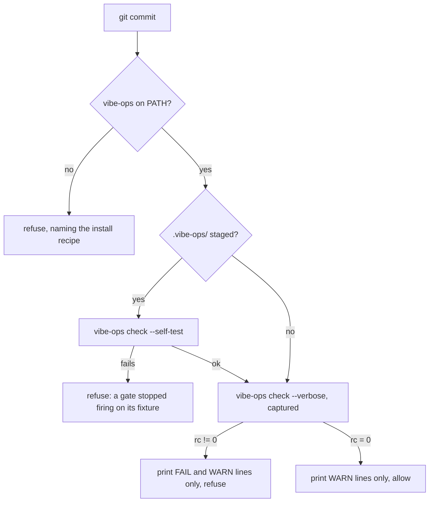

# Plan-007: The spec's own rules become local gates, and the shell runner goes

| Field | Value |
|---|---|
| Status | In Progress |
| Created | 2026-09-27 |
| Author | Danilo Borges |
| Related | vibe-ops RFC-0006 (the repository as a source of vibe-ops units), vibe-ops RFC-0013 (the gate's CI entrypoint) |

---

## Summary

Three rules about `spec/ref-id.json` are enforced only in CI today: the root specification matches its
own sidecar digest, the `relate` vectors reduce to what the `comparison` vectors say, and the `openRPC`
document is valid and tied to the rules and vectors it names. A commit that breaks any of them passes the
pre-commit gate and is found on the pull request. This plan moves each rule into a local vibe-ops gate —
a plain `.mjs` under `.vibe-ops/`, composed by this repository's own ops — so the commit gate refuses it
at the moment it is made. With nothing left for it to compose, the shell runner (`scripts/check.sh`,
`scripts/checks/_run.sh`) is deleted and `.githooks/pre-commit` calls `vibe-ops check` directly: the
end state vibe-ops RFC-0006 describes, reached early because this repository holds no shell fragment.

## Goals

- A commit that edits `spec/ref-id.json` without resealing, that makes a `relate` vector contradict a
  `comparison` vector, or that breaks the `openRPC` document is refused by `.githooks/pre-commit`, with a
  finding naming the file, the line where it can be found, and the JSON Pointer of the offending entry.
- Each rule is written once, in its gate. No script under `scripts/` restates it.
- `scripts/check.sh` and `scripts/checks/_run.sh` no longer exist, and no live document names them.
- CI runs the same composition the hook runs, through `vibe-ops check`.

## Scope

### In scope

Three local gates with fixtures and decoy tests; the reshaped local ops; the reseal writer reduced to a
call into the seal gate's `fix()`; deletion of the two check scripts and the shell runner; the hook and
the CI workflow rewired; every live reference updated.

### Out of scope

- `check-surface`, `differential`, `check-browser-purity`, `gen-readme-refs --check` and the grammar
  runners stay where they are. Each needs a build or a toolchain (tree-sitter, Swift, Rust, Python,
  Perl), and a gate must not stand in for a build or a CI.
- `gen-spec.mjs --check` stays: `packages/ref-id/test/spec-browser-staleness.test.ts` already covers it.
- Emitting readings to eita. Every rule here is structural — corrected once, then fixed — so a series
  would be a flat line of zeros. `vibeops.config.ts` already records the same judgement for the copies.
- Fixes in vibe-ops itself. Three defects surfaced while designing this plan and are filed there rather
  than worked around here (see Open questions).
- The workspace-root ops that compose into this repository only inside the maintainer's workspace
  (`model-lineup`, `delegation-judged`, `answers-awaiting-a-trait`). They skip, and nobody who clones
  this repository alone sees them.

## Design

### The gates

Each gate is a directory under `.vibe-ops/` named with the `gate-` prefix RFC-0006 specifies, so that
when vibe-ops learns to resolve a bare `{}` declaration from there, only the declaration changes. Each
default-exports a plain object `{ definition, run }` (plus `fix` where fixable) with no import from
`@entelekheia/vibe-ops-core`, which `loadGate` accepts and revalidates.

| Gate | `rule` | Fixable | Finding points at |
|---|---|---|---|
| `.vibe-ops/gate-spec-sealed/index.mjs` | `spec-unsealed` | yes — `fix()` writes `spec/ref-id.json.sha256` | `spec/ref-id.json.sha256` |
| `.vibe-ops/gate-relate-consistent/index.mjs` | `relate-disagrees` | no — repairing it means deciding which vector is wrong | `spec/ref-id.json`, line, pointer of the vector |
| `.vibe-ops/gate-openrpc-valid/index.mjs` | `openrpc-invalid` | no | `spec/ref-id.json`, line, pointer of the method or schema |

All three default to `fail`: a stale seal disables all three implementations at once, and the other two
are defects of the data that every port would otherwise report as its own failure.

**The logic moves, it is not wrapped.** `scripts/check-relate.mjs` and `scripts/check-openrpc.mjs` are
ported into their gates and deleted. `scripts/seal-spec.mjs` loses its `--check` mode to
`gate-spec-sealed`, whose `run()` compares and whose `fix()` writes.

**No gate loads the specification through the library.** Every identifier the `ref-id` package builds
passes through `loadSpec()`, which verifies the seal and refuses a broken specification — exactly the
state in which these gates must report. A gate that called it would throw instead of reporting, and the
whole `vibe-ops check` would refuse. Spelling a `ref:` by hand would restate the grammar, which
`.agents/rules/repo-guardrails.md` forbids. So `relate-consistent` and `openrpc-valid` read the file with
`JSON.parse`, and a finding is addressed by what the gate contract already carries: `file`, an optional
`line`, and an `evidence` string holding the JSON Pointer (`/vectors/relate/12`). The single import from
the package is `canonicalise` in `packages/ref-id/src/spec.ts`, a pure function; that module does not
load the specification at import time (the entry points call `installSpecSource`). Importing a `.ts`
source relies on Node's default type stripping, which starts at 22.18 — the same floor
`scripts/seal-spec.mjs` already depends on and vibe-ops RFC-0013 names for the CLI.

**`openrpc-valid` depends on `ajv`, `@open-rpc/meta-schema` and `@json-schema-tools/meta-schema`.** It
imports them dynamically inside `run()`. When they are absent (a clone with no `npm ci`) it returns
`skipped` naming the missing package, never a clean result and never a load failure that would take the
whole run down.

**Line numbers are best effort.** A small dependency-free helper under `.vibe-ops/` maps a JSON Pointer
to the line its value starts on by scanning the source text. When it cannot, the finding omits `line`;
the pointer in `evidence` is always present.

### The composition

`.vibe-ops/ops.json` keeps its three `mirror` entries and gains one entry per gate, each with a
`fixture` that must fire (`check --self-test` runs it). Because the collection now covers the whole
specification rather than its copies, its id and its key in `vibeops.config.ts` become `spec`, and the
comment there is rewritten to match. Beside each gate, an `index.test.mjs` holds the decoys — near-misses
that must not fire — asserting the finding count and the line each lands on, because the ops fixture
compares expected rules only and never inspects an unexpected finding. A `test:gates` script in
`package.json` runs those tests (`node --test .vibe-ops/`), and CI runs it.

### The reseal writer

`vibe-ops check` does not forward `--fix`; the only CLI surface that repairs is `vibe-ops hook ops <ops>
--fix <gate>`, which expects a hook payload on stdin. Three places tell a person to reseal by hand —
`.agents/skills/identify/SKILL.md`, `.agents/skills/identify/scripts/identify.ts` and the failure
message in `packages/ref-id/test/spec-integrity.test.ts` — so `scripts/seal-spec.mjs` stays as a writer
of a few lines that imports the gate and calls its `fix()`. It holds no digest logic of its own. It is
deleted the day vibe-ops offers a terminal `--fix`.

### The hook and the runner



`.githooks/pre-commit` absorbs the two jobs of `scripts/checks/_run.sh` that were not workarounds: the
refusal when `vibe-ops` is missing from `PATH`, and printing only what asks for action. It keeps the
per-attempt `GATE_ARTIFACT_DIR`. The fragment-directory export and the composition assertion go, because
there is no fragment to compose — measured before this plan: `vibe-ops check .` alone composes the same
60 checks as the runner, and `--self-test` passes. The manual entry point is `vibe-ops check` itself.

### CI

`.github/workflows/gates.yml` replaces the three steps that ran `seal-spec.mjs --check`, `test:relate`
and `test:openrpc` with an install of the published CLI (`npm i -g @entelekheia/vibe-ops-cli`),
`vibe-ops check --self-test`, `vibe-ops check`, and `npm run test:gates` — the hand-written form of what
vibe-ops RFC-0013 will publish as an action. The Node version there (`24.x`) is already above the floor.

## Tracks

Work happens in a worktree on a new branch (`git worktree add ../ref-id-plan-007 -b
plan-007-local-gates` from an up-to-date `main`). The tracks run in order, because each one needs the
previous one's output.

Where each track runs, and on which model, follows the workspace's model-routing rule. The rule has
two tables. The first decides **topology**: main loop, one subagent, or a Workflow fan-out. The second
decides `model` and `effort`. No track is wide enough for a Workflow: three gates sharing one helper
and one `ops.json` form a coupled change, and two agents must never write the same file. The
repository's own `ref-id-port-implementer` is scoped to one language port, and the workspace implementer
excludes this repository. So the one implementing delegation is a `general-purpose` agent. Every delegation's prompt opens
with its `[model-routing]` declaration line, and each verified result is judged once with
`node .eita/probe-delegation/record.mjs <agent id>` from the workspace root.

- [x] **Track 1 — The three gates.** Port `check-relate.mjs` and `check-openrpc.mjs` into their gates,
      write `gate-spec-sealed` with `run()` and `fix()`, the pointer-to-line helper, the decoy tests and
      one `fixture` each in `.vibe-ops/ops.json`, renamed `spec`. Each gate is observed **red before
      green**: its fixture and decoy test fail against a stub, then pass. At the end, `vibe-ops check
      --self-test` passes, `npm run test:gates` passes, and a deliberately unsealed spec, a flipped
      `relate` boolean and a removed `x-rule` target are each refused by `vibe-ops check` with the
      expected rule, file and pointer.
      *Routing:* `BUILD·M`, well specified. One `general-purpose` subagent,
      `[model-routing] shape=implement model=sonnet effort=medium`, behind a gate of three parts:
      `vibe-ops check --self-test`, `npm run test:gates`, and the three break scenarios, which the main
      loop re-runs itself before accepting anything. On a gate failure the subagent is re-dispatched with
      `model: opus`, at the definition's default `medium`. If Opus fails too, the track returns to the main loop.
      The brief carries five clauses. First, the contest clause: if a claim in the brief is wrong against
      the code, stop and cite `file:line`. Second, a refusal is an acceptable outcome, and weakening a
      fixture or a decoy to go green is forbidden. Third, no nested subagent. Fourth, report only work
      already done. Fifth, `git stash`, `git checkout` and `git restore` are forbidden by name.
- [x] **Track 2 — The scripts reduce to what is left.** Delete `scripts/check-relate.mjs` and
      `scripts/check-openrpc.mjs` and their `test:*` entries; reduce `scripts/seal-spec.mjs` to a call
      into the gate's `fix()`; update `docs/reference/the-ref-scheme.md`, the comment in
      `crates/ref-id/tests/relate.rs`, the gate name in `packages/ref-id/test/spec-integrity.test.ts`,
      and any other live reference `git grep` finds outside `project/plans/shipped/`. At the end,
      `node scripts/seal-spec.mjs` on an edited spec reseals it and `npm test` passes.
      *Routing:* **main loop**. Step two needs step one's whole output (the gate's exported `fix()`),
      the edits are small, and the reference sweep is a `git grep` — a deterministic answer that needs
      no model.
- [x] **Track 3 — The shell runner goes.** Delete `scripts/check.sh` and `scripts/checks/_run.sh`;
      rewrite `.githooks/pre-commit` per the Design; point `.claude/agents/ref-id-reviewer.md` at
      `vibe-ops check`; rewire `.github/workflows/gates.yml`. At the end, a commit with a broken spec is
      refused by the hook with only the FAIL lines, a clean commit prints nothing, and with `vibe-ops`
      removed from `PATH` the hook refuses naming the install recipe.
      *Routing:* **main loop**. It changes what every commit in this repository goes through, so it is
      OPERATE in effect. Its verification obligation is the three commit scenarios above, which only a
      real commit attempt exercises.
      **Review, after Track 3:** `ref-id-reviewer` over the whole branch. Its definition pins its model,
      so the call passes none, and the prompt opens with
      `[model-routing] shape=review model=opus effort=medium`. The brief names the risky parts: the
      seal gate's `fix()` writing a file that every port embeds, the dynamic import's `skipped` path,
      and the hook's exit codes. The main loop triages the findings; any fix is dispatched back as in
      Track 1.
- [x] **Track 4 — Report what vibe-ops should fix.** File the defects in Open questions that vibe-ops
      does not already track, each with its reproduction. Filed: vibe-ops issue #46 (absolute
      `core.hooksPath`); the other two were already #36 and #37.
      *Routing:* **main loop**. Filing an issue publishes content outward, so each issue's text is
      shown to the maintainer before `gh issue create` runs.
- [ ] Run `/vibe-ops:close-plan` — retrospective against the goals, the demotion check, the tracking
      issue closed. The plan file itself is kept. Stays unchecked until the plan is actually closed; a
      track list that is otherwise complete but has this box open is not finished.

## Success criteria

```sh
git grep -n 'scripts/check\.sh\|checks/_run\|check-relate\|check-openrpc' -- ':!project/plans/shipped'   # no hits
vibe-ops check --self-test; echo $?        # 0 — every fixture, including the three new ones, fires
vibe-ops check; echo $?                    # 0 on a clean tree
npm run test:gates && npm test             # decoys hold; the package still passes
# break each rule in a scratch commit — each is refused by .githooks/pre-commit with its own rule:
#   spec-unsealed, relate-disagrees, openrpc-invalid
node scripts/seal-spec.mjs && vibe-ops check   # reseal repairs spec-unsealed
```

The `gates` workflow is green on the pull request, with the three former steps replaced by `vibe-ops
check`.

---

## Decision Log

- Decision: The rule logic moves into the gates; the scripts do not survive as wrappers the gates spawn.
  Rationale: a gate that runs a script can only report the tail of its stdout; a gate that holds the
  logic reports the file, the line and the pointer of each offending entry.
  Date / Author: 2026-09-27 / Danilo Borges

- Decision: The gates never load the specification through the `ref-id` package, and findings are
  addressed by JSON Pointer rather than by a `ref:` identifier.
  Rationale: the package refuses a specification that fails its seal, which is precisely the state the
  gates exist to report; minting through it would crash the gate, and spelling a `ref:` by hand would
  restate the grammar. The pointer is the fragment a `ref:` would carry anyway.
  Date / Author: 2026-09-27 / Danilo Borges

- Decision: `openrpc-valid` is included, with its three dependencies imported dynamically and a
  `skipped` result when they are absent.
  Rationale: it reads the specification alone like the other two; a static import would turn a missing
  `node_modules` into a refusal of the whole run.
  Date / Author: 2026-09-27 / Danilo Borges

- Decision: The manual entry point is `vibe-ops check`, with no `npm run check` alias.
  Rationale: with no fragment to compose, the bare command runs the same 60 checks as the runner; a
  second door to the same thing is a name to keep in sync.
  Date / Author: 2026-09-27 / Danilo Borges

- Decision: Gates live under `.vibe-ops/gate-<name>/`, not `.vibe-ops/gates/<name>/`.
  Rationale: the prefix layout is RFC-0006's; when vibe-ops resolves local units by name from there, the
  files stay put and only the declaration changes.
  Date / Author: 2026-09-27 / Danilo Borges

- Decision: Only Track 1 is delegated: one `sonnet` `medium` subagent behind a real gate, escalating to
  `opus` on failure. Tracks 2–4 stay in the main loop, and `ref-id-reviewer` reviews the branch.
  Rationale: the model-routing rule sends a well-specified `BUILD·S/M` implement to the cheaper row
  behind a gate first. Track 2 is a chain that needs Track 1's output. Track 3 changes the commit
  path itself, and only the main loop can verify it by committing. Track 4 publishes outward. No
  track has independent facets, so no Workflow. `ref-id-port-implementer` is port-scoped and the
  workspace implementer excludes this repository, so the implementer is `general-purpose`.
  Date / Author: 2026-09-27 / Danilo Borges

- Decision: The hook runs `vibe-ops check --self-test` under `env -u GIT_DIR -u GIT_INDEX_FILE
  -u GIT_WORK_TREE -u GIT_PREFIX -u GIT_OBJECT_DIRECTORY`.
  Rationale: git exports those variables into every hook, and the self-test's `git -C <tmp> init/add`
  then writes its fixture tree into the commit's own index (vibe-ops issue #36). Reproduced on this
  branch in a scratch clone: 218 index entries changed without the wrapper, none with it. The wrapper
  goes when #36 is fixed upstream.
  Date / Author: 2026-09-27 / Danilo Borges

- Decision: CI installs `@entelekheia/vibe-ops-cli` pinned at `0.2.0`, not `latest`.
  Rationale: a CLI release must not change what this workflow checks without a commit here. Verified
  before pinning: the published `0.2.0`, run on a clone outside any enclosing configuration, composes the
  three local gates and passes `--self-test` and `check` (43 checks, 0 failed).
  Date / Author: 2026-09-27 / Danilo Borges

- Decision: Track 4 files one issue, not three.
  Rationale: the missing terminal `--fix` is already vibe-ops issue #37, and the `scripts/` ownership
  entries are RFC-0006 item 12 — planned work, not a defect. The absolute `core.hooksPath` defect is new,
  and weightier than first thought: Claude Code, creating an `isolation: worktree` subagent's worktree,
  rewrote this repository's shared `core.hooksPath` to an absolute path (observed 2026-09-27 21:31, when
  `ref-id-reviewer` started), so any repository that has hosted such an agent carries it.
  Date / Author: 2026-09-27 / Danilo Borges

## Outcomes & Retrospective

Nothing yet — the plan has not started.

---

## Open questions

Three things in vibe-ops this plan works around rather than fixes:

- `vibe-ops harness resolve` reports `HOOK=(none)` when `core.hooksPath` is absolute, because
  `cli/packages/harness/src/resolve.ts` joins the absolute path onto the repository root — vibe-ops
  issue #46. `git config core.hooksPath .githooks` sidesteps it locally.
- No terminal command runs a gate's `fix()` — vibe-ops issue #37. It is the one reason
  `scripts/seal-spec.mjs` survives.
- `--self-test` run from a hook writes into the commit's index — vibe-ops issue #36. The hook's `env -u`
  wrapper is the local workaround.

`cli/packages/harness/ownership.json` still classifies `scripts/check.sh` and `scripts/checks/_run.sh` as
`norm`, so `harness resolve` lists them as absent here; those entries retire with RFC-0006 item 12.

## Related

vibe-ops RFC-0006 (local units under `.vibe-ops/`, the runner's deletion), vibe-ops RFC-0013 (the CI
entry point), `.vibe-ops/ops.json` and `vibeops.config.ts` (the composition this plan extends).
