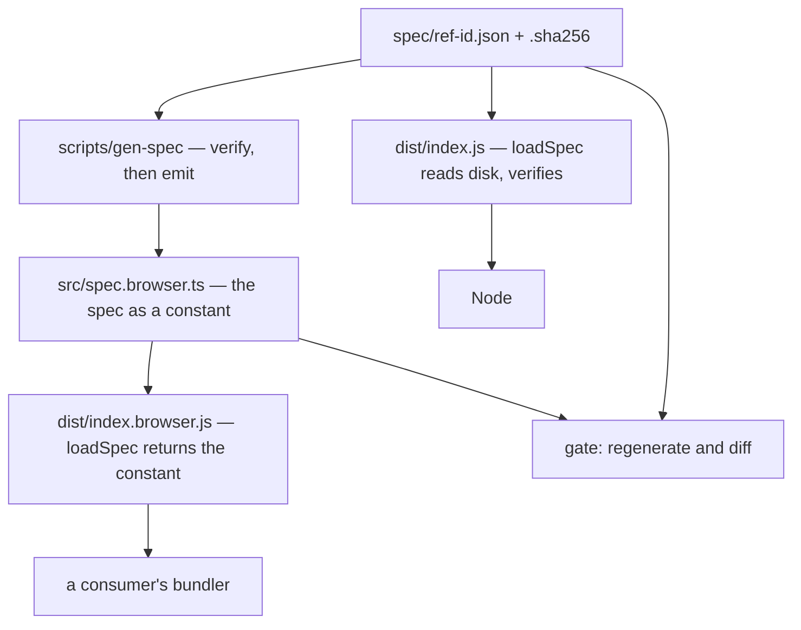

<!--
 Copyright (c) 2026 Danilo Borges (https://github.com/daniloborges)

 Licensed under the Apache License, Version 2.0 (the "License");
 you may not use this file except in compliance with the License.
 You may obtain a copy of the License at

 https://www.apache.org/licenses/LICENSE-2.0
-->

# Plan-004: The spec reaches the browser

| Field | Value |
|---|---|
| Status | Shipped |
| Created | 2026-09-17 |
| Author | Danilo Borges |
| Related | ADR-0001 (the specification is one data file the package consumes) |

---

## Summary

This package cannot run in a browser, and nothing says so. `build()` calls `loadSpec()` on every
invocation, and `loadSpec()` reads `spec/ref-id.json` from disk through `import.meta.url` and verifies it
against a sidecar digest using `node:fs` and `node:crypto`. A bundler has neither the file nor the
modules, so any consumer that runs client-side fails — at build time if its bundler refuses the `node:`
imports, and at runtime otherwise. That is every consumer that names something in a page: an extension, a
web application, anything that mints an identifier where the user is rather than where the server is.

This plan gives the package a second build whose spec is compiled in as a constant, served through the
`browser` condition of the package's `exports`. The public API does not change and no consumer changes a
line. Node keeps reading from disk and keeps verifying integrity at load; the browser receives bytes that
were verified when they were compiled in.

## Goals

1. `import { build, parse } from "@entelekheia/ref-id"` works in a bundled browser application, with no
   `node:` specifier reaching the bundle and no configuration on the consumer's side.
2. The browser build and the Node build agree, proven by running the spec's own conformance vectors
   against both and comparing, rather than by running each against its own expectations.
3. The compiled-in spec cannot silently drift from `spec/ref-id.json`: a stale artifact fails the gate
   rather than shipping.
4. The integrity guarantee ADR-0001 chose is preserved in a form the browser can have — verified at
   build, declared in the artifact — rather than dropped.
5. The package's published surface states which environments it runs in, so the next consumer learns this
   from the package instead of from a failed bundle.

## Scope

### In scope

- A generated module carrying the spec, produced from `spec/ref-id.json` by a build step.
- A `browser` condition in `package.json` `exports`, and whatever second entry point it needs.
- A gate check that fails when the generated module does not match the spec it was generated from.
- A differential test that runs the conformance vectors through both builds.
- A statement in `README.md` and `AGENTS.md` of which environments the package supports.

### Out of scope

- **Changing the spec.** `spec/ref-id.json` is the data and this plan does not touch its content, its
  version, or its vocabulary. A change there is a different plan.
- **Changing the public API.** `build`, `parse`, `serialise`, `digest`, `canonical` and
  `validateEnvelope` keep their signatures. `loadSpec()` keeps returning the same object; only where the
  bytes came from differs, and only in the browser build.
- **A runtime integrity check in the browser.** Hashing the spec in the browser would verify a constant
  against a constant compiled from the same source in the same build — a check that cannot fail, which is
  worse than no check because it reads like one. The Design section says what replaces it.
- **The other language ports.** They have their own packaging and their own environments; if the same gap
  exists there it is their own plan.
- **A CDN or unbundled `<script>` distribution.** This plan serves a bundler. Shipping something a browser
  can load without one is a separate decision with its own surface.

## Design

### Why the gap exists at all, and why it is not a packaging slip

`spec.ts` imports `node:fs` and `node:crypto` at module scope, and resolves the spec and its sidecar
relative to `import.meta.url`. `build.ts` imports `loadSpec` from it and calls it on every invocation.
So the dependency is not optional and not lazy: importing anything from the package's entry point pulls
the filesystem in.

That is the correct design for the decision ADR-0001 recorded — the specification is one data file the
package consumes, and consuming it means reading it and checking that it is the file it claims to be. The
gap is not that the decision was wrong; it is that *reading from disk* was treated as the only way to
consume a data file, and a browser has no disk.

### The shape



The generator is the only thing that reads the JSON at build time. It verifies the sidecar digest first —
so a spec that fails integrity never becomes a module — and then emits the spec as a typed constant. The
browser entry point's `loadSpec()` returns that constant and touches nothing.

### Where the integrity guarantee goes

In Node the check stays exactly as it is: bytes are read, hashed, compared, and a mismatch throws. In the
browser there is nothing to compare, so the guarantee moves earlier: **the generator refuses to emit a
module from a spec whose digest does not match**, and the gate refuses a generated module that does not
match the spec currently on disk. The property the reader cares about — *the spec in this artifact is the
published spec* — is preserved; what changes is who establishes it and when.

The generated module carries the digest it was built from as a declared field, so an artifact can say
which spec it holds without being able to check it. That is a statement, not a verification, and it is
labelled as one in the module itself.

### The staleness guard, and why it is the load-bearing part

A generated file that is valid code and out of date is the failure mode with no symptom: the build is
green and the behaviour is a version behind. So the gate regenerates into a temporary location and
diffs — it does not merely check that the file exists or that a timestamp is newer, because both pass for
a file edited by hand.

### What a consumer sees

Nothing. `exports` gains a `browser` condition above the default; bundlers that honour it take the
browser build, Node takes the default, and a consumer that configures neither gets the right one either
way. A consumer that deliberately wants the Node build in a browser-ish environment can still reach it
through the default condition.

## Tracks

- [x] **Track 1 — The generator and its guard.** A build step reads `spec/ref-id.json`, verifies it
      against its sidecar, and emits the spec as a typed constant module; a gate check regenerates and
      diffs, failing when the committed module does not match. At the end, editing the JSON without
      regenerating turns the gate red, and regenerating turns it green — both demonstrated, not asserted.
      It is written **beside `scripts/seal-spec.mjs`, not apart from it**: that script already reads the
      spec, already imports `canonicalise` from the package's own source, and already owns the sidecar it
      writes. Two scripts with independent ideas of how the spec is read is the drift this whole plan is
      about.

- [x] **Track 2 — The browser entry point.** A second entry whose `loadSpec()` returns the constant, wired
      into `exports` under the `browser` condition, with the build emitting both artifacts. At the end,
      `dist/index.browser.js` contains no `node:` specifier and no `import.meta.url`, checked
      mechanically rather than by reading.
      **Landed differently in one respect, and the difference is the track's substance.** `loadSpec()` was
      not the only way a filesystem reached the browser: `digest.ts` imported `node:crypto` too, so the
      entry point alone could not have removed the dependency. The package now has two seams rather than
      one — `spec.ts` holds the spec source, `hash.ts` holds the sha256 — and each entry installs one pair
      (`spec.node.ts` + `hash.node.ts`, or `spec.browser.ts` + `hash.browser.ts`). The two entry points
      differ in two lines and in one export. The mechanical check is
      `scripts/check-browser-purity.mjs`, run at `postbuild`: it walks the emitted module graph — 35
      modules, including into `node_modules` — rather than grepping the entry file, because `tsc` emits one
      module per source file and that grep passes by construction. Proven in four directions: a builtin in
      a deep module, `import.meta.url` in a deep module, the browser entry reaching `spec.node.js`, and a
      computed `import()` the walk cannot follow all turn it red; the clean tree turns it green.
      **A code review then found a fifth seeded defect the walk would have missed, and it was real.**
      The resolver looked `exports` keys up literally, so a pattern key (`"./*": "./real/*.js"`) matched
      nothing and the code fell through to resolving the specifier as a path on disk — against a package
      with a decoy file at the unsubstituted path, it returned the decoy while Node's own resolver
      returned the real target, which imported a builtin. The root cause was wider than the pattern key:
      when a package declares `exports`, a subpath it does not list is *not exported*, and guessing on
      disk is the opposite of that rule. Both are fixed — Node's longest-prefix pattern match, and
      nothing on disk when `exports` governs — and verified against `import.meta.resolve` on five cases.

- [x] **Track 3 — The browser build becomes a fourth implementation.** `scripts/differential.mjs` already
      runs every implementation over the same inputs and fails on the first disagreement, and it exists
      because the ports canonicalised a Package URL three different ways for as long as no vector
      constrained the field. That is precisely the failure this plan could reintroduce, one build apart
      instead of one language apart — so the browser build is registered there as another implementation
      rather than given a suite of its own. A suite of its own would compare each build against its own
      expectations, which is the check that stayed green while the three ports disagreed. At the end, a
      deliberate divergence introduced into one build fails `npm run test:differential`, demonstrated.
      **Done:** `parse-lines.ts` gained `--browser`, which selects the browser entry through a dynamic
      import — same runner, same protocol, same child process, one import apart — and `differential.mjs`
      carries it as a fourth row. The purl-validity exemption was scoped per implementation at the same
      time: it is bought by three validators being three different pieces of software, and the browser
      build resolves the same `packageurl-js` the Node build does, so a purl disagreement between those
      two is a defect rather than a known edge. **Demonstrated:** removing `:` from the `ai-model`
      locator pattern in the compiled-in constant alone made `ref:ai-model:llama3:8b` diverge on `status`
      and `serialised`; `npm run test:differential` exited 1 naming the row, and `npm test` exited 1
      independently on the staleness guard. Regenerating returned both to 0. 157 inputs × 4
      implementations, 0 disagreements.
      **One gap the harness could not close, closed beside it.** The line protocol is shared with the
      Rust and Swift ports and carries `parse` and `serialise` only, so `spec.vectors.build`, `digest`
      and `envelope` stayed exercised against the Node build alone — and the browser build's sha256, a
      different implementation rather than a different call to the same one, was exercised by nothing.
      `test/browser-parity.test.ts` runs those three groups through both entry points and compares the
      two builds, rather than giving the browser build expectations of its own. It spawns a child
      process per entry, because both entries import one `spec.ts` module instance: importing them into
      one process makes the second installation win, and the comparison becomes a build against itself,
      reported as agreement. Proven by corrupting the browser sha256 — the test fails naming the vector.

- [x] **Track 4 — Say what it supports.** `README.md` and `AGENTS.md` state which environments the package
      runs in and what the browser build gives up, so that the next consumer learns this from the package.
      **Done:** the package README's `Requirements` section became `Environments`, with a table of where
      the spec comes from and when its integrity is established in each build, and four named things the
      browser build gives up (no runtime integrity check, no `loadSpecFrom`, sha256 only, the bundle cost).
      The root README points at it. `AGENTS.md` gained the guarantee-changes-hands paragraph and now says
      four implementations rather than three. `.agents/rules/repo-guardrails.md` had a sentence that
      stopped being true — `packageurl-js` and Node's `crypto` as the whole runtime surface — and gained a
      second guardrail against a builtin reaching the browser graph.

- [x] Run `/vibe-ops:close-plan` — retrospective against the goals, the demotion check, the tracking
      issue closed. The plan file itself is kept.

## Success criteria

Run from the repository root:

```sh
npm run build                      # emits both artifacts
npm test                           # every existing test
npm run test:differential          # every implementation, now including the browser build
./scripts/check.sh; echo $?        # 0, including the staleness guard
grep -c "node:" dist/index.browser.js          # 0
grep -c "import.meta.url" dist/index.browser.js # 0
```

Then, in a scratch project with any bundler that honours the `browser` condition: importing `build` from
this package, calling it with a valid set of parts, and getting the same string the Node build returns for
the same parts — with the bundle produced and no `node:` specifier in it.

And the guard, demonstrated rather than assumed: change one byte of `spec/ref-id.json`, regenerate the
sidecar, run the gate, and observe it fail on the stale generated module; regenerate, and observe it pass.

---

<!-- ===== LIVING SECTIONS — maintained during the work, not written at the end ===== -->

## Decision Log

- Decision: the browser gets a second build served through the `browser` condition of `exports`, rather
  than an injectable spec or a single build with the spec always compiled in.
  Rationale: an injectable spec moves the choice onto every client-side consumer and deletes the integrity
  guarantee there — each consumer would import the JSON and pass it, and nothing would check that what it
  passed is the published spec. A single always-compiled build is simpler and gives up the runtime
  verification that ADR-0001 deliberately chose, which would mean superseding an accepted decision to buy
  convenience. The `browser` condition keeps both: Node unchanged and verifying at load, the browser served
  bytes verified when they were compiled. No consumer changes a line, which matters because the consumers
  that need this are exactly the ones that cannot be asked to.
  Date / Author: 2026-09-17 / Danilo Borges

- Decision: the browser build does not hash its own spec at runtime.
  Rationale: it would hash a constant and compare it against a digest compiled from the same source in the
  same build. Such a check cannot fail, which makes it worse than no check — it reads as a guarantee and
  is a tautology. The guarantee moves to the generator, which refuses to emit from a spec that fails its
  sidecar, and to the gate, which refuses a generated module that no longer matches. The artifact declares
  the digest it was built from as a statement about its provenance, labelled as a statement.
  Date / Author: 2026-09-17 / Danilo Borges

- Decision: the staleness guard regenerates and diffs, rather than checking existence or timestamps.
  Rationale: a generated file that is valid code and one version behind is the failure with no symptom —
  the build is green and the behaviour is wrong. A timestamp check passes for a file edited by hand, and
  an existence check passes for any file at all. Only regenerating and comparing tests the property that
  matters.
  Date / Author: 2026-09-17 / Danilo Borges

- Decision: **how this plan is carried out.** The generator, the staleness guard, the differential suite
  and the mechanical proof that no `node:` specifier survives into the browser bundle may be handed to a
  subagent, each behind a gate that must pass before the result is accepted. Not delegated: the shape of
  `exports`, what the integrity guarantee becomes and how the artifact declares it, and any change to
  `spec/ref-id.json`.
  Rationale: the split is mechanical-versus-judgement. The delegated half has a closed contract that fits
  in a paragraph and a gate that decides whether it was met. The retained half is judgement that has to
  agree with this plan's intent — a subagent does not hold the plan, and what it returns is plausible and
  drifts. Recording the split here rather than leaving it agreed in conversation is deliberate: a
  conversation is summarised and dropped, and the agreement is then broken by the same agent that made it.
  Date / Author: 2026-09-17 / Danilo Borges

- Decision: the browser build takes its sha256 from `@noble/hashes` rather than from a hand-written
  implementation or an asynchronous API.
  Rationale: this was not anticipated when the plan was written — the plan reasoned about `loadSpec()` and
  missed that `digest.ts` imports `node:crypto` on its own, so the browser build needed a synchronous
  sha256 before it needed anything else. WebCrypto is the only hash the web platform publishes and it is
  asynchronous, so using it would turn `digest()` and `validateEnvelope()` into promises — a change to the
  public API this plan puts out of scope, and one that would leave the two builds with different surfaces
  to compare, defeating Goal 2. Blocking on it is not available: `Atomics.wait` throws on a browser's main
  thread by specification, and the Worker + `SharedArrayBuffer` arrangement that would work needs the
  consumer to serve two headers. Between a hand-written primitive and a dependency, the maintainer chose
  the dependency: `@noble/hashes` is pure JavaScript with no dependencies of its own, so it does not
  violate the guardrail against a native runtime, and it is audited where a sixty-line in-house sha256
  would not be. The cost is real and recorded: it enters the manifest of every consumer, including the
  Node ones that never reach it, and `AGENTS.md` and the guardrail rule were corrected because they both
  declared a runtime surface that no longer holds.
  Date / Author: 2026-09-17 / Danilo Borges

- Decision: the mechanical proof walks the emitted module graph rather than grepping the entry file, and
  follows `require()` as well as `import`.
  Rationale: the criterion as written (`grep -c "node:" dist/index.browser.js` → 0) passes by
  construction. `tsc` emits one module per source file, so the browser entry is a handful of re-export
  lines whatever the rest of the graph imports; the builtin would sit in `dist/spec.node.js`, which that
  grep never opens. The walk resolves the way a bundler does, with the `browser` condition ahead of
  `import`, and reports an unresolvable specifier as a failure rather than skipping it. Following
  CommonJS was bought by a measurement, not by foresight: the first version read only ESM syntax,
  stopped at `packageurl-js`'s CJS entry file, and reported a clean closure of 21 modules while never
  seeing the fourteen that entry requires. The plan's literal greps still run and still return 0 — they
  are the floor, and the comments in the browser entry are worded to avoid both literals rather than
  letting prose about their absence turn the criterion red.
  Date / Author: 2026-09-17 / Danilo Borges

## Outcomes & Retrospective

**Shipped 2026-09-17**, in two pull requests: [#14](https://github.com/entelekheia-ai/ref-id/pull/14)
carried Tracks 1 through 4, and [#15](https://github.com/entelekheia-ai/ref-id/pull/15) carried a CI
repair that this plan's own harness change exposed. All four tracks landed; none was cut.

### The goals, one by one

1. **`import { build, parse }` works in a bundled browser application, no `node:` specifier, no consumer
   configuration.** Met, and verified past the criterion rather than against it. A scratch consumer
   bundled with esbuild carries zero Node builtins, and running it in Chrome 153 — with no `process` and
   no `require` in scope — returns the same string and the same digest the Node build returns for the
   same parts.
2. **The two builds agree, proven by the vectors and by comparison rather than by each build's own
   expectations.** Met, and the plan under-specified what it would take. `scripts/differential.mjs`
   carries the browser build as a fourth implementation, but its line protocol is shared with the Rust
   and Swift ports and carries `parse` and `serialise` only — so `spec.vectors.build`, `digest` and
   `envelope` would have stayed exercised against the Node build alone, and the browser build's sha256
   would have been exercised by nothing at all. `test/browser-parity.test.ts` closes that, comparing the
   two builds rather than giving either its own expectations.
3. **A stale compiled-in spec fails the gate rather than shipping.** Met. Demonstrated at closure in both
   directions: one byte changed in `spec/ref-id.json` and resealed turns `npm test` red on the staleness
   guard and `./scripts/check.sh` red on port-copy and doc drift; regenerating turns both green.
4. **The integrity guarantee is preserved in a form the browser can have.** Met as designed. The
   generator refuses to emit from a spec that fails its sidecar; the browser build does not re-hash its
   own constant, and exports `SPEC_DIGEST` as a statement about provenance rather than a check.
5. **The published surface states which environments it runs in.** Met. `Requirements` became
   `Environments` in the package README, with a table and four named things the browser build gives up.

### What the plan got wrong

- **It missed a second dependency on the filesystem.** The Design reasoned entirely about `loadSpec()`
  and never noticed that `digest.ts` imports `node:crypto` on its own account. The browser entry point
  alone could therefore never have met Goal 1. The response was a second seam (`hash.ts` beside
  `spec.ts`), which is an extension of the pattern the plan chose rather than a new one — but the plan as
  written would not have produced a working build.
- **Two success criteria were unrunnable as written.** `grep -c "node:" dist/index.browser.js` and its
  sibling name a path that does not exist from the repository root; the artifact is at
  `packages/ref-id/dist/index.browser.js`. Wrong in the direction of failing to run, not of passing
  falsely.
- **One success criterion attributed a guard to the wrong gate.** `./scripts/check.sh; echo $?` is
  annotated *"0, including the staleness guard"*. The staleness guard is a `node --test` case and runs in
  `npm test`; `check.sh` composes the governance gate and does not include it. The gate does go red on a
  spec edit, but through the port-copy and doc-drift checks — a different mechanism reaching the same
  colour, which is exactly the kind of coincidence a criterion should not rely on.
- **The mechanical check the plan asked for would have passed by construction.** `grep`ping the emitted
  entry point cannot fail: `tsc` emits one module per source file, so that file is re-export lines and
  the builtin sits in `dist/spec.node.js`. The walk over the whole closure replaced it; the plan's greps
  are kept as a floor and still return 0.

### What the work cost beyond its scope

- **A runtime dependency.** `@noble/hashes` entered the package because the web platform publishes no
  synchronous hash and making `digest()` asynchronous would have changed the public API. `AGENTS.md` and
  `.agents/rules/repo-guardrails.md` both declared `packageurl-js` and Node's `crypto` as the whole
  runtime surface; both were corrected.
- **A CI repair.** Registering the browser build as a fourth implementation put the harness under enough
  attention to notice it had been red on `main` since [#13](https://github.com/entelekheia-ai/ref-id/pull/13)
  and naming no cause. Three defects, fixed in #15: the `differential` job runs `npm ci` and never
  creates the gitignored spec copy the package reads; `port()` discarded the child's `stderr`, which is
  why two red runs named nothing; and — the one that matters — the harness promoted the next row that
  managed to run into the reference seat, so on this plan's own PR the browser build silently became the
  reference and the run reported *157 inputs × 4 implementations, 1 disagreement* for a comparison it had
  never made. The count was true and the claim under it was not.

### Still open

The third open question is the only one this plan answered with a number and not a decision: the compiled
constant is 67 597 bytes of a 148 148-byte unminified consumer bundle, roughly 46 %. Whether a trimmed
spec is worth the second artifact it would create is untouched — `declaredBy` and `reference` are long
prose fields the code never reads, and they hold most of that weight. The first two open questions
(bundlers that ignore the `browser` condition; whether a test runner should resolve it) are also
untouched, and a fourth was found at closure: under `"moduleResolution": "bundler"` without
`customConditions`, TypeScript resolves types through the default condition while the bundler takes the
browser build, so `tsc --noEmit` accepts an import of `loadSpecFrom` that the bundle refuses. That is
documented in the package README rather than solved.

<!-- ===== END LIVING SECTIONS ===== -->

---

## Open questions

- Does any bundler in common use ignore the `browser` condition and take the default, and if so, does it
  fail loudly or produce a bundle that breaks at runtime? The second is much worse and would argue for the
  single-build shape this plan rejected.
- Should the browser build be the one a test-runner picks up? A runner that resolves `browser` would run
  the suite against the compiled-in spec and never exercise the disk path, which is the opposite of what
  the differential suite is for.
- ~~The spec is a substantial data file. Compiling it in costs every client-side consumer that many bytes,
  whether or not they use the parts of the spec that made it large. Nothing here measured the resulting
  bundle size~~ — **measured 2026-09-17**: the emitted constant is 67 597 bytes and a whole consumer
  bundled with esbuild (unminified, ESM, `platform=browser`) is 148 148 bytes, so the specification is
  roughly 46 % of it. The question it was asked in service of stays open: whether a trimmed spec —
  carrying only what the code reads — is worth the second artifact it would create. `declaredBy` and
  `reference` are long prose fields the code never reads, and they are where most of that 67 KB is.

## Related

- ADR-0001 — the specification is one data file the package consumes. This plan does not supersede it: the
  spec stays one data file, and the change is to how the package consumes it in an environment with no
  filesystem.
