<!--
 Copyright (c) 2026 Danilo Borges (https://github.com/daniloborges)

 Licensed under the Apache License, Version 2.0 (the "License");
 you may not use this file except in compliance with the License.
 You may obtain a copy of the License at

 https://www.apache.org/licenses/LICENSE-2.0
-->

# Plan-008: The Python port

| Field | Value |
|---|---|
| Status | Shipped |
| Created | 2026-09-27 |
| Author | Danilo Borges |
| Depends on | Plan-007 (the local gates this plan extends) |
| Related | Plan-001 (the decision this plan reverses), ADR-0001, ADR-0002 |

---

## Read these first

For anyone resuming this plan mid-run, in this order:

1. This file's **Decision Log** — every decision the maintainer took while the tracks ran, including three
   rounds of specification changes (the dialect `anchor`; spec 1.6.0's integers, maximum version and
   Unicode digest members; the security review's refinement bound, scalar matching and declared errors).
   The tracks below are the original scope; the Decision Log is what the work became.
2. `docs/reference/implementation-differences.md` — the measured Package URL edges between the four
   implementations, the one copy of that table.
3. The task dossiers `project/tasks/044` to `050`, one per track, each ending in the rulings and deferred
   minors that track produced; `048` covers Track 7 and both security rounds.
4. `.agents/skills/verify-hostile-input/SKILL.md` (first named `attack`) — the security review this plan produced as a reusable procedure.

## Summary

The scheme has three implementations — the TypeScript reference, the Rust crate and the Swift package —
and Plan-001 dropped a Python port on 2026-09-07 because no consumer needed one. A consumer written in
Python now exists and will store and compare `ref:` identifiers, so this plan adds a fourth, complete
implementation: a pure-Python package, `ref-id` on PyPI and `ref_id` on import, that consumes
`spec/ref-id.json` like the others, is held to every vector group and to the declared `openRPC` surface,
joins the differential as a fifth row, and publishes from the same release as the npm package, the crate
and the Swift tag. The grammar runner `spec/conformance/grammar-check.py` is retired in the same change,
because the port proves the `python-re` dialect on a superset of what that runner checked.

## Goals

- `python/` holds a package that implements all fourteen methods the `openRPC` document declares, passes
  every group in `spec.vectors` under `pytest`, and passes `mypy --strict` and `ruff` — on Python 3.11,
  the oldest version the first consumer runs.
- `npm run test:differential` runs five rows, the Python port among them, over every input and every
  ordered pair, and reports no disagreement other than the per-implementation Package URL verdict edge.
- `npm run test:surface` fails when the Python package exports a public function no method declares, and
  the generated Python surface file fails `mypy` when a declared method is missing or its signature moved.
- A commit that breaks the Python port, lets its embedded specification drift, or leaves its generated
  surface stale is refused by `vibe-ops check` from `.githooks/pre-commit`.
- Merging the "Version Packages" pull request publishes `ref-id` to PyPI at the same version as
  `@entelekheia/ref-id`, through trusted publishing, with no token stored anywhere.

## Scope

### In scope

The package under `python/`; the `openRPC` additions that declare Python's casing and extensions; the
surface generator and its checks; the line-protocol server and the differential row; two new local gates
and the Python pairs in the two existing mirror gates; the CI job; the PyPI publish step and the version
sync; the retirement of `spec/conformance/grammar-check.py`; every document and agent definition that
counts or lists the implementations.

### Out of scope

Adopting the package in its first consumer — changing what a consumer stores is that consumer's own work,
exactly as Plan-001 held for the npm package. Wiring `--check` for the Rust and Swift surface generators
is folded into the staleness gate below only because the gate costs nothing more for three than for one;
fixing the other drift the survey found in comments (`scripts/differential.mjs` still says "three",
`Sources/RefIdConformance/main.swift` documents `--pairs` without `verdict`) is corrected where a track
already edits the file, and nowhere else.

## Design

### The package

`python/pyproject.toml` declares the distribution `ref-id`, `requires-python = ">=3.11"`, the build
backend `hatchling`, and one runtime dependency: `packageurl-python`, the library the Package URL
specification maintains, pinned to a compatible range from 0.17.6. Everything else is the standard
library — `hashlib` for SHA-256, `json` for the canonical serialisation, `re` for the grammar,
`importlib.resources` for the embedded specification. Development uses `uv` (`uv sync`, `uv run pytest`,
`uv run mypy --strict src tests`, `uv run ruff check`) from inside `python/`.

The source lives in `python/src/ref_id/`, with `py.typed`, and mirrors the Rust module split — `spec`,
`grammar`, `encoding`, `parse`, `serialise`, `build`, `canonical`, `digest`, `envelope`, `validators`,
`relations`, `types` — because that split is already the smallest one that keeps each concern testable
alone; the Rust crate is 2003 lines across those modules, `relations` alone 696. `ref_id/__init__.py`
re-exports the declared methods, types and extensions, and declares `__all__`; nothing outside `__all__`
is public.

`python/src/ref_id/spec/` holds `ref-id.json` and `ref-id.json.sha256`, byte-identical to the root copies.
The copy sits inside the package because only there does the wheel carry it and `importlib.resources`
find it; it is the Python equivalent of `crates/ref-id/spec/`. `load_spec()` verifies the embedded file
against its sidecar on first load, as the Node build does, and caches the result.

**Grammar.** The port applies `grammar.adaptations["python-re"]` to every pattern the specification
declares before compiling it — the two replacements the specification already carries, `(?<` to `(?P<`
and `$` to `\Z`. No pattern is written in the source.

**Delegated validation.** A Package URL goes to `PackageURL.from_string`. The SWHID core form is validated
in-house, under the exception ADR-0002 already declares. `validators.py` is a name-to-behaviour registry
like `crates/ref-id/src/validators.rs`: a validator or delegate name it does not know degrades to
`uncovered`; a range or policy name it does not know is a version mismatch and raises.

`packageurl-python` behaves differently from both existing validators at the edge the differential already
exempts, measured on 0.17.6: it refuses an empty name after a namespace (`pkg:npm/@scope/`), as the Rust
crate and the Swift validator do, and accepts a version ending in `/` (`pkg:npm/foo@1.0.0/`), as
`packageurl-js` does. A locator's validity belongs to the format, so the port reports what its validator
says and the differential treats the Python row like every other row that does not share the reference's
validator.

**Naming.** `openRPC.x-casing` gains `"python": "snake_case"`, so the port spells `canonicalIdentifier`
as `canonical_identifier`, as Rust does. `openRPC.x-extensions` gains `"python": ["embedded_spec_text"]`.
The error type is `RefIdError`, a subclass of `ValueError`. Both additions are spec edits made first, per
the rule that a public surface change is a spec edit before it is code. They change no identifier's
meaning, so they need a reseal and no `specVersion` change — the commit that introduced the whole
`openRPC` document (`001c51c`) left `specVersion` where it was.

### How the port is held

```mermaid
flowchart LR
  spec[spec/ref-id.json] --> gen[scripts/gen-surface-python.mjs]
  gen --> surf[python/tests/test_surface.py]
  spec --> copy[python/src/ref_id/spec/]
  copy --> pytest[pytest: every vector group]
  surf --> mypy[mypy --strict]
  pkg[python/src/ref_id] --> pytest
  pkg --> mypy
  pkg --> lines[python/tools/parse_lines.py]
  lines --> diff[scripts/differential.mjs: 5 rows]
  pkg --> cs[scripts/check-surface.mjs: __all__]
  pytest --> gate1[gate python-conformance]
  gen --> gate2[gate surface-generated]
  copy --> gate3[mirror spec-bytes / spec-seal]
  gate1 & gate2 & gate3 --> hook[vibe-ops check: pre-commit and CI]
```

**Vectors.** `python/tests/test_conformance.py` runs each group and holds a literal list of the groups it
executes; a test asserts that `spec.vectors` declares no group outside that list, exactly as
`crates/ref-id/tests/conformance.rs` does. A new group therefore fails the Python suite until someone runs
it. Another test asserts the embedded copy is byte-identical to the root specification when the root is
present.

**Surface.** `scripts/gen-surface-python.mjs` reads only `openRPC` and writes
`python/tests/test_surface.py`: one typed binding per method (`_parse: Callable[[str], ParseResult] =
ref_id.parse`) that `mypy --strict` checks against the real signatures, plus a runtime test that the
declared list equals the specification's. It has a `--check` mode, like its Rust and Swift siblings.
`scripts/check-surface.mjs` gains a `python` language that reads `ref_id.__all__` through
`uv run --project python python -c` and fails on any name no method, extension or alias declares.

**Differential.** `python/tools/parse_lines.py` speaks the same line protocol as the three existing
servers: `\\n` and `\\r` unescaped, one `ParseResult` per line with keys sorted by the port's own
`canonicalise`, `serialised` added when serialisation succeeds, `canonical` kept only under `--canonical`,
`{"threw": …}` and exit 1 on a throw, and under `--pairs` one `{covers, coversReversed, samePackage,
sameIdentifier, relate, verdict}` object per pair, exiting 1 on an odd line count. It lives under
`tools/` rather than in the package so it never reaches `__all__`. `scripts/differential.mjs` gains a
`python` row in both its `ports` and `pairPorts` arrays, run as `uv run --project python python
python/tools/parse_lines.py`. The row is not added to `SHARES_THE_REFERENCE_VALIDATOR`, since its Package
URL validator is different software.

**Local gates.** Two new gates under `.vibe-ops/`, in the plain-module shape Plan-007 set — a default
export with `definition`, `run(ctx)` returning `{findings, examined}` or `{findings: [], skipped}`, a
failing `fixture` in `.vibe-ops/ops.json`, and an `index.test.mjs`:

- `gate-python-conformance` spawns `uv run --directory python pytest --junitxml=<tmp>` (`--directory`, not `--project`: pytest finds
  its configuration in `python/pyproject.toml` only when it runs there) and turns every
  failed test case in the JUnit report into a finding naming the test and the vector group. JUnit XML is
  pytest's built-in report, so the port gains no test dependency for the gate's sake. A missing `uv` on
  `PATH`, or a run past the timeout, is `skipped` with the reason, never a pass.
- `gate-surface-generated` runs `gen-surface-python.mjs --check`, and the Rust and Swift generators'
  `--check` beside it, each needing only Node; a stale file is a finding naming it.

The existing `spec-bytes` and `spec-seal` mirror entries each gain one pair, the Python copy of
`ref-id.json` and of its sidecar. No other gate changes.

### Release

`scripts/sync-versions.sh` copies the npm package's version into `python/pyproject.toml` beside the
crate manifest. `.github/workflows/release.yml` gains a PyPI probe in its "did this run release?" step and
conditional steps in the same release job that build with `uv build` inside `python/` and publish with
`pypa/gh-action-pypi-publish` pinned to `v1.14.2`, `packages-dir: python/dist`, `skip-existing: true`,
under the job's existing `permissions: id-token: write`. The first publish goes through a pending trusted
publisher on pypi.org for project `ref-id`, repository `entelekheia-ai/ref-id`, workflow `release.yml`,
with no environment restriction — declared 2026-09-27, so nothing in the release is manual. The steps
name no GitHub environment: an environment is set per job, and naming one here would put the npm and crate
publishes behind it too. One changeset on `@entelekheia/ref-id` versions all
four artifacts, as it already does for three.

## Tracks

Tracks 2–4 are the port itself and run in order, each behind `uv run pytest` and `uv run mypy --strict`.
Tracks 1, 5 and 6 are the harness shared between languages.

- [x] **Track 1 — The specification declares Python.** Add `python` to `openRPC.x-casing` and
      `x-extensions`, reseal, and copy the specification into the port copies. Write
      `scripts/gen-surface-python.mjs` with `--check`. At the end, the generator emits a surface file for a
      package that does not yet exist, and the `openrpc-valid` gate passes.
- [x] **Track 2 — The package, its specification and the canonical core.** `python/pyproject.toml`, the
      embedded specification and its mirror pairs, `load_spec`, `load_spec_from`, `canonicalise`,
      `digest`, the grammar with the `python-re` adaptation, and the group-refusal test. Acceptance: the
      `digest` vectors pass, the group-refusal test lists every group not yet run, and the mirror gates
      pass with the new pairs.
- [x] **Track 3 — Parse, serialise, build and the envelope.** `parse`, `serialise`, `build`,
      `canonical_identifier`, `validate_envelope`, and the validator registry delegating to
      `packageurl-python`; first, by the main loop, the `anchor` field of the dialect adaptations (see the
      Decision Log) and a Python test that every pattern the specification declares compiles. Acceptance: the `parse`, `canonical`, `roundtrip`, `build` and `envelope`
      groups pass.
- [x] **Track 4 — Relations.** `covers`, `same_package`, `same_identifier`, `relate`, `verdict`, including
      the descent into nested identifiers. Acceptance: every group passes, the group-refusal test lists
      none, and `mypy --strict` passes on the generated surface file.
- [x] **Track 7 — The edges the port exposed: integers, oversized versions, lone surrogates.** Runs after
      Track 4 and before Track 5, carrying the three Decision Log entries of 2026-09-28 that name it. Add the rule to
      `/canonicalisation` and a `canonicalisation` vector group whose inputs are raw JSON text, reseal and
      copy; then each implementation parses the text with its own JSON parser and canonicalises it —
      TypeScript, Rust, Swift and Python, each adding the group to the list its runner executes.
      Acceptance: all four suites run the group; `1.0` and `1e2` canonicalise to `1` and `100`, `1.5` and
      `9007199254740992` are refused, everywhere; an oversized version literal is `unsupported` with
      `versionText` kept, and a lone-surrogate digest member is refused, in all four, each by a vector.
- [x] **Track 5 — The port joins the harness.** `python/tools/parse_lines.py`, the `python` rows in
      `scripts/differential.mjs`, the `python` language in `scripts/check-surface.mjs`, the two new gates
      with fixtures and tests, and a `python` job in `.github/workflows/gates.yml` plus Python and `uv` in
      the macOS `differential` job, the differential's corpus drawn from every vector group carrying
      identifiers — `relate`, `verdict`, `build` and `envelope` too, which the security review found
      omitted — and `node --test scripts/gen-surface-python.test.mjs` in the Node job — the
      generator's own tests run nowhere until then. Retire `spec/conformance/grammar-check.py`: `test:grammar` runs Perl
      alone and the step names stop saying "three engines". Acceptance: `npm run test:differential`
      reports five rows and no failure; `vibe-ops check --self-test` sees both new gates fire on their
      fixtures; a deliberately broken vector in a scratch branch is refused at commit.
- [x] **Track 6 — Release and documents.** `scripts/sync-versions.sh`, the PyPI probe and publish job in
      `.github/workflows/release.yml`, the changeset, and every place that counts or lists the
      implementations: `AGENTS.md`, `README.md` and `scripts/gen-readme-refs.mjs`, `vibeops.config.ts`,
      the `.vibe-ops/ops.json` summary, the comments in `scripts/differential.mjs` and the line servers,
      and the line-protocol row Python gains in `.claude/agents/ref-id-reviewer.md` (both agent definitions
      learned Python's gate in Track 1, before the implementer was first dispatched). Acceptance: `npm run version` leaves the three manifests on one version, and the first release
      puts `ref-id` on PyPI through the pending publisher already declared.
- [x] Run `/vibe-ops:close-plan` — retrospective against the goals, the demotion check, the tracking
      issue closed. The plan file itself is kept. Stays unchecked until the plan is actually closed; a
      track list that is otherwise complete but has this box open is not finished.

## Success criteria

- `cd python && uv run pytest && uv run mypy --strict src tests && uv run ruff check` exits 0 on
  Python 3.11 and on the newest Python the CI image carries.
- `npm run test:differential` prints five implementations and exits 0.
- `npm run test:surface` exits 0, and exits 1 when a function is added to `ref_id.__all__` without a
  declaration.
- `vibe-ops check` from `.githooks/pre-commit` lists `python-conformance` and `surface-generated` as run,
  not skipped, on a machine with `uv`, and refuses a commit that edits `python/src/ref_id/spec/ref-id.json`
  alone.
- `pip install ref-id==<version>` in a fresh environment, then `python -c "import ref_id;
  print(ref_id.parse('ref:pkg:npm/left-pad@1.0.0'))"`, prints a parse result whose status is `ok`.

---

## Decision Log

- Decision: a fourth, complete implementation in pure Python, reversing Plan-001's decision of
  2026-09-07 to drop the Python port.
  Rationale: a consumer written in Python now needs the scheme, and needs all of it — it will compare
  identifiers, not only emit them. A pure port rather than bindings over the Rust crate, because a binding
  is the crate again and adds no independent reading of the specification, which is what the differential
  exists to collect; bindings would also need a wheel per platform.
  Date / Author: 2026-09-27 / Danilo Borges

- Decision: `spec/conformance/grammar-check.py` is deleted; `spec/conformance/grammar-check.pl` stays.
  Rationale: the Python runner compiles the adapted expression and replays `vectors.parse`; the port
  compiles the same adapted expression and replays every group, so the runner becomes a strict subset of a
  gate that already runs. The `pcre2` dialect has no port, so the Perl runner remains its only proof. This
  reverses the part of Plan-001's decision that kept both runners.
  Date / Author: 2026-09-27 / Danilo Borges

- Decision: checks outside CI are local vibe-ops gates, never shell scripts, and a check needing Python
  wraps the Python tool and reads its native report.
  Rationale: Plan-007 removed the shell runner; a Python check that bypassed the gate would be a second
  composition. JUnit XML is pytest's own output, so the gate reads a report instead of parsing text.
  Date / Author: 2026-09-27 / Danilo Borges

- Decision: PyPI in the same release, at the same version, through trusted publishing.
  Rationale: the repository's rule is one version line and no publishing token. The pending publisher was
  declared on pypi.org on 2026-09-27 without an environment restriction, and the publish steps run in the
  existing release job without one — an environment is per job, so a PyPI-only approval rule would need a
  job of its own.
  Date / Author: 2026-09-27 / Danilo Borges

- Decision: delegation follows the workspace model-routing rule. The port tracks (2–4) go to
  `ref-id-port-implementer`, whose definition pins its model and effort, one track per dispatch, behind
  `pytest` and `mypy --strict`, escalating to `opus` only after that gate fails. The shared harness
  (Tracks 1, 5 and 6) stays in the main loop, because each edit touches every language's contract at once.
  Every track is reviewed by `ref-id-reviewer` before it merges, and triaging its findings is the caller's.
  Rationale: the maintainer's direction on 2026-09-27 to follow the routing rule; the port is a
  well-specified implement behind a real gate, the harness is a coupled change.
  Date / Author: 2026-09-27 / Danilo Borges

- Decision: a dialect adaptation gains an `anchor` field that replaces only the `$` ending a pattern;
  `replace` keeps the substitutions that apply everywhere (`(?<` → `(?P<` for `python-re`). `python-re`
  declares `anchor: "\\Z"` and `pcre2` `anchor: "\\z"`; no `specVersion` change, since no identifier's
  meaning moves. Carried out in Track 3, by the main loop before the implementer is dispatched.
  Rationale: a plain replace of every `$` reached the `$` inside character classes of
  `forms.origin-url.pattern`, which then did not compile in Python and would have refused every origin
  identifier; `grammar.anchors` already said the adaptation exists for the final `$`. The maintainer chose
  this over rewriting the pattern or special-casing it in code.
  Date / Author: 2026-09-28 / Danilo Borges

- Decision: canonicalisation defines its numbers — a number is canonical when it is an integer whose
  magnitude is below 2^53, written as that integer; an integral value written with a fraction or an
  exponent (`1.0`, `1e2`) is that integer; any other number is refused with `SpecIntegrityError`. A new
  vector group `canonicalisation` binds it, with raw JSON text as input, and all four implementations run
  it. Carried out in Track 7.
  Rationale: `/canonicalisation` said "integers only" without saying what `1.0` or a large integer
  becomes, and the implementations disagreed; JavaScript cannot tell `1.0` from `1`, which forces the
  integral-value half, and cannot hold an integer at or above 2^53 exactly, which forces the bound. The
  Swift port already applied this rule. The maintainer chose to resolve it in this plan.
  Date / Author: 2026-09-28 / Danilo Borges

- Decision: the specification declares `version.maximum` = 9007199254740991 (2^53 − 1, the largest integer
  every implementation holds exactly); a version literal above it makes the identifier `unsupported`, with
  `versionText` keeping the literal and `version` reporting the maximum. A `parse` vector binds it, and all
  four implementations follow — TypeScript too, which reported a rounded float. Carried out in Track 7.
  Rationale: reading `ref:9223372036854775808:pkg:npm/x@1.0.0` as version 1 canonicalised it to the key of
  a different identifier, which a store would then file together; the review of Track 3 found Rust and
  Swift already diverging and Python inheriting it from the crate. The maintainer chose to fix it here.
  Date / Author: 2026-09-28 / Danilo Borges

- Decision: `digest` refuses a member that does not encode as UTF-8 — a lone surrogate — with
  `DigestError` in every implementation; a `digest` vector binds it, and TypeScript stops replacing the
  surrogate with U+FFFD. Carried out in Track 7, and announced in Track 6's changeset because it changes
  the published npm package's behaviour.
  Rationale: TypeScript's lossy encoding made `digest(["…\ud800"])` equal `digest(["…\ufffd"])`, so its
  `validateEnvelope` admitted members other than the ones a digest was minted over; Python already refused.
  The maintainer chose to fix it here.
  Date / Author: 2026-09-28 / Danilo Borges

- Decision: Track 7 is carried out as the specification edit in the main loop, then one
  `ref-id-port-implementer` per language — TypeScript, Rust, Swift, Python — in parallel on disjoint write
  sets, each behind its own gate, as that agent's definition prescribes for "the specification moved".
  Rationale: the four code changes are independent once the vectors exist; the main loop keeps the spec.
  Date / Author: 2026-09-28 / Danilo Borges

- Decision: the lone-surrogate rule is stated in `/digest` and pinned by unit tests in TypeScript and
  Python, not by a vector.
  Rationale: a JSON string holding a lone surrogate stops the Rust crate from loading the specification at
  all (`serde_json` refuses it), and neither a Rust nor a Swift `String` can hold one, so only the two
  implementations that can receive the input can be tested with it.
  Date / Author: 2026-09-28 / Danilo Borges

- Decision: Track 7 also carries two things the review of Track 4 found — vectors for three pair shapes no
  vector bound (one scoped package at two versions, a nested pair refused on one side only, a verdict
  decided by a fragment refinement), whose expected values every implementation already produces; and the
  TypeScript `parse` throwing on a qualifier key that names an `Object.prototype` member (`constructor`),
  fixed with an own-property lookup and bound by a `parse` vector.
  Rationale: the three shapes survived planted faults in the Python suite and would in any port; the
  throw breaks the rule that parsing never raises, and Rust and Python already return `uncovered`.
  Date / Author: 2026-09-28 / Danilo Borges

- Decision: a security review over the four implementations, after Track 7, and three of its findings
  fixed in a second round of Track 7 within spec 1.6.0 (not yet published): refinement integers take the
  `version.maximum` bound, a literal above it making the identifier malformed at that refinement, with
  vectors at 2^53+1, 2^63+1 and 2^64+1; Swift matches the grammar and splits by Unicode scalar rather than
  by grapheme cluster, with `parse` vectors gluing a combining mark to each separator; TypeScript wraps
  the exceptions `loadSpecFrom` and `canonicalise` let escape as `SpecIntegrityError`.
  Rationale: each is a place where one store would admit what another refuses, or where a caller meets an
  error the surface does not declare. The review's other findings fit the tracks that introduced them
  and were fixed there. The maintainer chose all three.
  Date / Author: 2026-09-28 / Danilo Borges
- Decision: the Package URL canonical spelling becomes the specification's. The specification will
  declare, per Package URL type it dispatches, the normalisation its canonical form applies (npm lowercases
  namespace and name), bound by vectors, and every implementation applies it after its library. This is a
  plan of its own, outside Plan-008.
  Rationale: the field is informational — measured 2026-09-28, `same_identifier` and `same_package` agree
  in all four implementations on every pair of two spellings of one locator — but the differential
  compares it and a consumer may store it, so leaving it to four libraries leaves four answers.
  Date / Author: 2026-09-28 / Danilo Borges
- Decision: an encoded `#` in a nested npm namespace, and an undecodable or truncated percent-escape in any
  Package URL component, are known edges rather than specification rules. They are written, with every
  other measured edge, in `docs/reference/implementation-differences.md`, which becomes the one copy of the
  edge table: `AGENTS.md`, `scripts/differential.mjs` and the `attack` skill point at it, and the four
  package READMEs link it. `packageurl-python`'s acceptance of a version ending in `/` is not reported
  upstream.
  Rationale: the table had three copies, and all three were wrong somewhere when re-measured; a user who
  moves identifiers between implementations needs it more than a contributor does. The trailing `/` is
  accepted by Swift too, and the Package URL specification does not settle it.
  Date / Author: 2026-09-28 / Danilo Borges
- Decision: the tasks close in the publication pull request and the plan closes in a later one, after the
  release has published to PyPI; so the `node-and-rust` job checks out full history again (`fetch-depth: 0`),
  which Plan-007 had dropped.
  Rationale: Plan-007 took shipped plans out of the `breadcrumb` gate on the premise that only a shipped plan
  carries `git show` pointers; a plan whose dossiers close before it carries them while in progress, and a
  depth-1 checkout resolved none of them (six findings on PR #51, none with full history). The pointers name
  this branch's commits, so the pull request merges with a merge commit, never squash or rebase.
  Date / Author: 2026-09-28 / Danilo Borges
- Decision: the gates workflow runs as two jobs — one on Linux for everything that does not need Swift,
  one on macOS for the differential and the Swift conformance runner, which share one Swift build — and
  the differential overlaps its runs: each compiled port starts when its own build finishes, the slow pair
  passes split one slice per core. The Rust build is cached between runs; the Swift one is not.
  Rationale: runner time is spent energy and quota even on a public repository, and each job pays its own
  setup and rounds up to the minute, a macOS minute counting ten. Measured on the runner: the differential
  job went from 3m34s to 1m47s–2m39s, bound by CPU on three cores; the Rust cache took its build from
  35–50 s to 12 s, while a restored Swift `.build/` still rebuilt in 31 s, so that cache was dropped.
  Date / Author: 2026-09-28 / Danilo Borges

## Outcomes & Retrospective

Shipped in 0.7.0 (pull requests #51 and #52, 2026-09-28): the Python port on PyPI, beside the npm package,
the crate and the Swift tag, with spec 1.6.0. Every track landed; none was cut.

Against the goals, one by one, each success criterion run on 2026-09-28 after the release:

- **The package.** `python/` implements the fourteen `openRPC` methods and passes every vector group — 711
  tests on 3.11 and on 3.14, `mypy --strict` clean over 27 source files, `ruff` clean. Met.
- **The differential.** Five rows over every input the vectors carry and every ordered pair — 305 inputs,
  93,025 pairs, 0 disagreements. Met, and weaker than it reads: an undecodable percent-escape in a Package
  URL is `malformed` in TypeScript and `ok` in the other three, and the differential stayed green over it
  because no vector carries one. Agreement on the vector corpus says nothing about the inputs no vector
  names; the security review, not the differential, found that edge. It is documented in
  `docs/reference/implementation-differences.md` as a known edge, by the maintainer's decision.
- **The surface.** `npm run test:surface` exits 1 with an undeclared function in `ref_id.__all__` and 0
  without it; `mypy` over the generated `test_surface.py` holds each declared signature. Met.
- **The commit gate.** `python-conformance` (711 examined) and `surface-generated` (4 examined) run, not
  skip, and an edit to `python/src/ref_id/spec/ref-id.json` alone is refused. Met.
- **PyPI.** Merging the Version Packages pull request published `ref-id` 0.7.0 through trusted
  publishing, with no token stored; `pip install ref-id==0.7.0` in a fresh 3.14 environment parses
  `ref:pkg:npm/left-pad@1.0.0` as `ok`. Met.

**The prediction that was wrong: that a port needs no specification change.** The plan scoped a port held
to the vectors as they stood. Writing a fourth implementation, and reviewing it adversarially, found
defects the three existing ones shared or split on — a dialect adaptation that broke a pattern, numbers
with no canonical rule, an oversized version read as version 1 by three implementations, a lossy surrogate
digest and prototype-keyed lookups in TypeScript, Swift trapping on hostile numbers and matching by
grapheme cluster, quadratic relations in Rust. Each was fixed across every implementation and bound by
vectors, in two rounds of spec 1.6.0 (Track 7, added mid-plan). A new implementation is the cheapest
adversarial review the specification gets.

**Beyond the goals:** the `verify-hostile-input` skill, a reusable security review of the four
implementations; the Package URL edge table as a user-facing reference; a gates workflow cut from four
jobs to two, and a differential that overlaps its runs (3m34s to under 2 minutes on the runner).

**Open, and who inherits it:**

- The Package URL canonical spelling becomes a specification rule, per Package URL type (Decision Log,
  2026-09-28) — a plan of its own, not yet written.
- The deferred minors of dossiers 044–050, listed in each closure's breadcrumb commit, none blocking.

---

## Open questions

None. Every question this plan raised was answered and moved to the Decision Log.

- Task dossiers closed and removed per the task lifecycle (`Planned → In Progress → Done → file removed, git history is the archive`):
  - `git show 1f9a8139a12856298f9e59ad05790add19c44222:project/tasks/044-the-specification-declares-python.md`
  - `git show 1f9a8139a12856298f9e59ad05790add19c44222:project/tasks/045-the-python-package-and-its-canonical-core.md`
  - `git show 1f9a8139a12856298f9e59ad05790add19c44222:project/tasks/046-python-parse-serialise-build-and-the-envelope.md`
  - `git show 1f9a8139a12856298f9e59ad05790add19c44222:project/tasks/047-python-relations.md`
  - `git show 1f9a8139a12856298f9e59ad05790add19c44222:project/tasks/048-the-edges-the-port-exposed.md`
  - `git show 1f9a8139a12856298f9e59ad05790add19c44222:project/tasks/049-the-python-port-joins-the-harness.md`

- Task dossiers closed and removed per the task lifecycle (`Planned → In Progress → Done → file removed, git history is the archive`):
  - `git show 1739078551ad1b48e677c5ef0a3e70cc2a1d5527:project/tasks/050-release-the-python-port-and-document-it.md`
